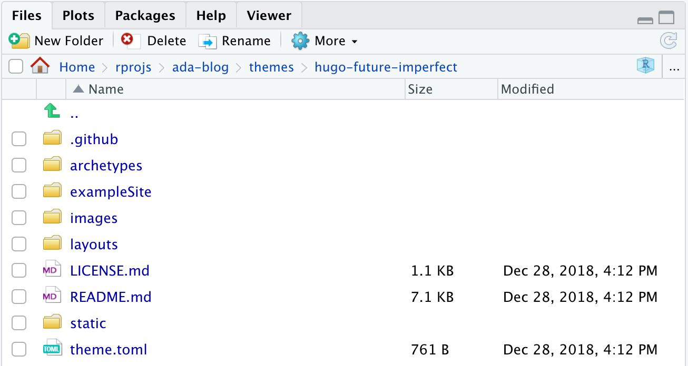
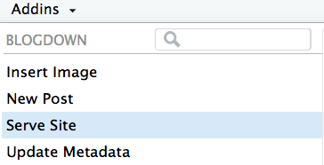
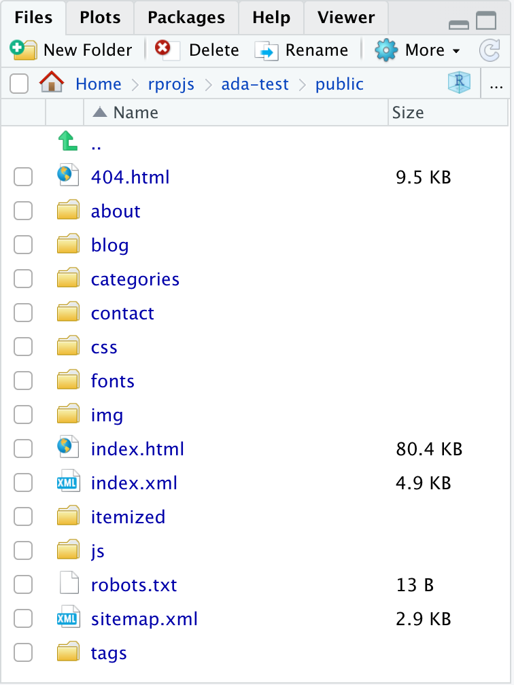
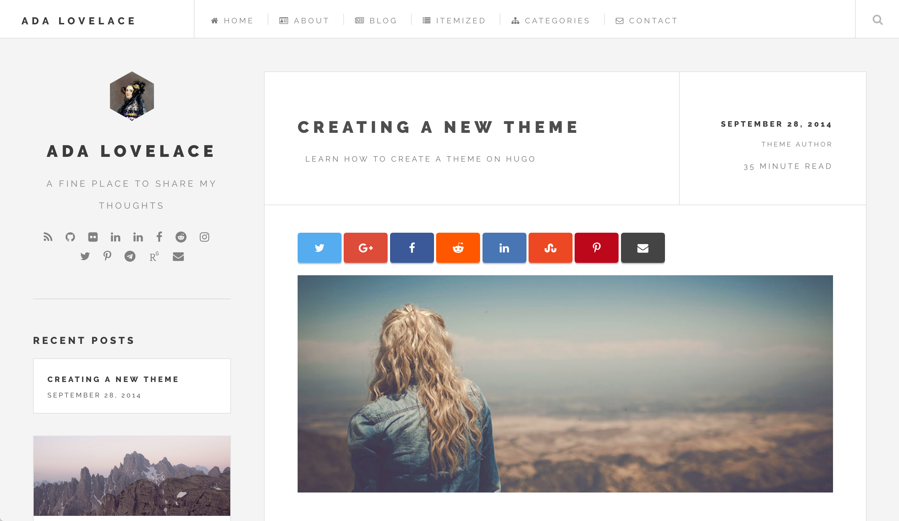

```{r setup, include=FALSE}
options(htmltools.dir.version = FALSE)
library(knitr)
knitr::opts_chunk$set(warning = FALSE, message = FALSE, fig.align = "center", out.width = "80%")
# options(knitr.table.format = "html")
library(tidyverse)
library(babynames)
library(fontawesome) # from github: https://github.com/rstudio/fontawesome
```

layout: true
  
<div class="my-footer"><span>bit.ly/blogdown-rsconf19</span></div>

<!-- this adds the link footer to all slides, depends on my-footer class in css-->

---

class: left, middle, title-slide

# Meet blogdown


### .fancy[Making Websites in R Markdown]

.large[Alison Hill | rstudio::conf | `r Sys.Date()`]

<!-- this ends up being the title slide since seal = FALSE-->

---

## So what is blogdown?<sup>*</sup>


- [R Markdown](https://rmarkdown.rstudio.com) 

    - (relatively) simple syntax for writing documents
    
    - the simpler, the more portable (multiple output formats)
    
    - not only convenient (maintenance), but also reproducible
    
    - most features of R Markdown _and_ [**bookdown**](https://bookdown.org) (technical writing)!!

--

- [Hugo](https://gohugo.io) 

    - free, open-source, and easy to install (a single binary)
    
    - lightning fast (generates one page in one millisecond)
    
    - general-purpose (not only for blogs)

.footnote[
[\*] From Yihui: https://slides.yihui.name/2017-rmarkdown-UNL-Yihui-Xie.html#35.
]

???

Pandoc's Markdown: paragraphs, section headings, (un)numbered lists, blockquotes, math expressions, tables, images, footnotes, bibliography/citations, ...

See Chapter 2 of the **bookdown** book for additional Markdown features, such as figure/table captions, cross-references, numbered equations, theorems, ...


---

## Why not WordPress, Tumblr, Medium.com, Blogger.com, etc?<sup>*</sup>

- No R Markdown support (even math support is often nonexistent or awkward)

--

- Huge benefits of static websites compared to dynamic websites

    - all static files, no PHP or databases, no login/password, work everywhere (even offline)
    
    - typically fast to visit (no computation needed on the server side), and easy to speed up via CDN

.footnote[
[\*] From Yihui: https://slides.yihui.name/2017-rmarkdown-UNL-Yihui-Xie.html#36.
]

???

If all you want to write about is what you had for breakfast today, or how cute your kittens are, there is no need to use blogdown. If there is anything related to R, statistical computing, and/or graphics, blogdown will be much more convenient.

---
class: middle, center, inverse

# .fancy[All about Ada]


---
name: workflow
class: inverse, middle

# Do one

--

.pull-left[

### .fancy[.center[Local setup `r emo::ji("computer")`]]


1. Make a [repo on <i class="fab fa-github fa-lg fa-fw"></i>GitHub](https://happygitwithr.com/new-github-first.html#make-a-repo-on-github-1)

1. Make a [new RStudio project via git clone](https://happygitwithr.com/new-github-first.html#new-rstudio-project-via-git-clone)

    *File > New Project > Version Control > Git*

1. Run:

```{r eval = FALSE}
library(blogdown)
new_site(theme = "jpescador/hugo-future-imperfect", 
         sample = TRUE, 
         theme_example = TRUE, 
         empty_dirs = TRUE,
         to_yaml = TRUE)
```

]

--

.pull-right[

### .fancy[.center[Cloud setup `r emo::ji("cloud")`]]


1. Make a new RStudio project via wizard

    *File > New Project > New Directory > <br>  Website using blogdown*

```{r echo = FALSE, out.width='80%'}
knitr::include_graphics("img/blogdown-workflow-wizard.png")
```


]


???

if an exampleSite exists, it will be in themes/<hugo-future-imperfect>/exampleSite


theme_example copies that exampleSite into your project root directory (you can always delete the content later)


sample adds a sample R Markdown blog post (can end up in wrong place though)

empty_dirs keeps some folders that are initially empty but for important reasons I'll tell you about

finally, to_yaml converts all the exampleSite content to YAML instead of TOML files. We'll talk more about the difference, but this saves you time and is helpful to have done automatically for you.


---
name: dir-structure

# Directory Structure

```{r eval = FALSE}
.
├── .Rproj.user/
├── ada-blog.Rproj
├── archetypes/ 
├── config.toml
├── content/
├── data/
├── index.Rmd
├── layouts/ 
├── public/
├── resources/
├── static/
├── staticman.yml
└── themes/
```


.footnote[
https://gohugo.io/getting-started/directory-structure/
]

---

# Directory Structure

```{r eval = FALSE}
.
├── .Rproj.user/
├── ada-blog.Rproj
├── archetypes/ 
├── config.toml
├── content/
├── data/
├── index.Rmd #<<
├── layouts/ 
├── public/ #<<
├── resources/
├── static/
├── staticman.yml
└── themes/
```

???

index.Rmd does one thing- let's open it up- it is your only R markdown YAML. It specifies your output format as a blogdown site.

public is where your final rendered site files will go

You never touch this folder- it re-generates every time we serve our site

---

# Directory Structure

```{r eval = FALSE}
.
├── .Rproj.user/
├── ada-blog.Rproj
├── archetypes/ 
├── config.toml
├── content/
├── data/
├── index.Rmd
├── layouts/ 
├── public/
├── resources/
├── static/
├── staticman.yml
└── themes/ #<<
```

???

themes is where all the Hugo theme files go

You also never touch this folder!

So how do you edit a Hugo theme if you are not to touch anything in this folder?

---
class: middle, inverse

# `r emo::ji("key")` Overriding vs editing

> *When you use a theme cloned from its git repository, do not edit the theme’s files directly. Instead, theme customization in Hugo is a matter of overriding the templates made available to you in a theme. This provides the added flexibility of tweaking a theme to meet your needs while staying current with a theme’s upstream.* https://gohugo.io/themes/customizing/


--

Note which folders are *empty* at the top level of your project:

```{r eval = FALSE}
.
├── .Rproj.user/
├── ada-blog.Rproj
├── archetypes/ #<<
├── config.toml
├── content/
├── data/
├── index.Rmd
├── layouts/ #<<
├── public/
├── resources/
├── static/
├── staticman.yml
└── themes/
```

???

This is why we kept the empty directories when we started our site.

I believe having these here will help you when you do want to edit your theme, as a gentle reminder that you are never to touch the themes folder!

---

# Themes

Look in `/themes/hugo-future-imperfect/`. Notice now the folder structure here *mirrors* your Hugo directory structure.

```{r echo = FALSE, out.width='75%'}

```

---

# Override files in...

.pull-left[
your .fancy[.bright[theme]] directory...
```{r eval = FALSE}
.
├── archetypes/ #<<
├── exampleSite/
├── images/
├── layouts/ #<<
└── static/ #<<
```
]

.pull-right[
...with files in your .fancy[.bright[project]] directory.
```{r eval = FALSE}
.
├── .Rproj.user/
├── ada-blog.Rproj
├── archetypes/ #<<
├── config.toml
├── content/
├── data/
├── index.Rmd
├── layouts/ #<<
├── public/
├── resources/
├── static/ #<<
├── staticman.yml
└── themes/
```
]

---

class: center, inverse, middle

# `r emo::ji("bellhop_bell")`

# Serve site!

Mouse up to "Addins" ➡️ "Serve site"



---
class: center, inverse, top

# `r emo::ji("tada")` Success?


```{r echo = FALSE, out.width='75%'}
include_graphics("img/blogdown-exampleSite.png")
```


.footnote[
.fancy[.bright["Show in new window"]] to see in local browser
]

---
class: middle, inverse, center

# `r emo::ji("house")`

## Edit the configuration file

---

# Open `config.toml`

- TOML<sup>*</sup> is like YAML, but not 

.pull-left[
```{r eval = FALSE}
+++
title = "Lab 06: CS631"
tags = ["toml","yaml"]

type = "article"

[amp]
elements = []
    
[article]
lead = "Lorem ipsum."
category = "frontmatter"
related = []
+++
```
]

.pull-right[
```{r eval = FALSE}
---
title: "Lab 06: CS631"
tags:
- toml
- yaml
type: article
amp:
  elements: []
article:
  lead: Lorem ipsum.
  category: frontmatter
  related: []
---
```
]

.footnote[
[\*] https://gohugohq.com/howto/toml-json-yaml-comparison/
]

---

# Open `config.toml`

- blocks wrapped by `+++` vs `---` <sup>*</sup> 
- Your `config.toml` file doesn't show this explicitly but it is there!

.pull-left[
```{r eval = FALSE}
+++ #<<
title = "Lab 06: CS631"
tags = ["toml","yaml"]

type = "article"

[amp]
elements = []
    
[article]
lead = "Lorem ipsum."
category = "frontmatter"
related = []
+++ #<<
```
]

.pull-right[
```{r eval = FALSE}
--- #<<
title: "Lab 06: CS631"
tags:
- toml
- yaml
type: article
amp:
  elements: []
article:
  lead: Lorem ipsum.
  category: frontmatter
  related: []
--- #<<
```
]

.footnote[
[\*] https://gohugohq.com/howto/toml-json-yaml-comparison/
]

---

# Open `config.toml`

- key-value pairs are separated by a `=` vs `:` <sup>*</sup> 

.pull-left[
```{r eval = FALSE}
+++ 
title = "Lab 06: CS631" #<<
tags = ["toml","yaml"]

type = "article"

[amp]
elements = []
    
[article]
lead = "Lorem ipsum."
category = "frontmatter"
related = []
+++ 
```
]

.pull-right[
```{r eval = FALSE}
--- 
title: "Lab 06: CS631" #<<
tags:
- toml
- yaml
type: article
amp:
  elements: []
article:
  lead: Lorem ipsum.
  category: frontmatter
  related: []
---
```
]

.footnote[
[\*] https://gohugohq.com/howto/toml-json-yaml-comparison/
]

---

# Open `config.toml`

- YAML uses indentation with one or more spaces to describe nested collections <sup>*</sup>

.pull-left[
```{r eval = FALSE}
+++ 
title = "Lab 06: CS631" 
tags = ["toml","yaml"] #<<

type = "article"

[amp]
elements = []
    
[article]
lead = "Lorem ipsum."
category = "frontmatter"
related = []
+++ 
```
]

.pull-right[
```{r eval = FALSE}
--- 
title: "Lab 06: CS631" 
tags: #<<
- toml #<<
- yaml #<<
type: article
amp:
  elements: []
article:
  lead: Lorem ipsum.
  category: frontmatter
  related: []
---
```
]

.footnote[
[\*] https://gohugohq.com/howto/toml-json-yaml-comparison/
]

---

# Edit `config.toml`

```{r eval = FALSE}
baseurl = "/" #<<
languageCode = "en-us"
title = "Ada Lovelace" #<<
theme = "hugo-future-imperfect"
preserveTaxonomyNames = true
paginate = 3
disqusShortname = "shortname"
googleAnalytics = ""
pluralizeListTitles = false
# Set the followings to true as part of your site SEO
enableRobotsTXT = true
canonifyURLs = true
ignoreFiles = ["\\.Rmd$", "\\.Rmarkdown$", "_files$", "_cache$"] #<<
relativeURLS = true #<<

[params]
  # Sets the meta tag description
  description          = "Ada's blog" #<<
  # Sets the navbarTitle that appears in the top left of the navigation bar
  navbarTitle          = "Ada Lovelace" #<<
  # Sets where "View More Posts" links
  viewMorePostLink     = "/blog/"
```

- `<title>Ada Lovelace</title>`

- `ignoreFiles`: copy and paste this from your R console when you first served your site

- *.bright[Very important!]* Setting `relativeURLS` is critical for `r emo::ji("cloud")` setup

???

The first thing I do with any new Hugo theme is make sure the baseurl is just a forward slash. That will always work. This theme has that already, but some don't

Do not change theme here- but it refers to the theme folder you want.

You could have multiple Hugo themes in your themes/ directory.

So the theme name should match the name of the folder that holds the theme you want to use.


---
class: middle, inverse, center

## .fancy[.bright[NEW!]] A full `public` folder


```{r out.width='35%', echo = FALSE}

```


---
name: section
class: middle, inverse
background-image: url(callum-shaw-557874-unsplash.jpg)
background-size: cover

---
name: outline
template: section


# `r emo::ji("old_key")` .fancy[Outline]

+ Edit the `config.toml`

+ Add content

+ Deploy


---

# Go back to `config.toml`


```{r eval = FALSE}
baseurl = "/" 
theme = "cocoa-eh-hugo-theme"
builddrafts = true
canonifyurls = true
contentdir = "content"
languageCode = "en-US"
layoutdir = "layouts"
publishdir = "public"
author = "Ada Lovelace" 
title = "Ada Lovelace" 
disqusshortname = ""
pluralizelisttitles = false
ignoreFiles = ["\\.Rmd$", "\\.Rmarkdown$", "_files$", "_cache$"] 
enableEmoji = true #<<
```

???

There are some standard parameters in hugo config.toml files- just because it isn't in the site's example config doesn't mean you can use them!

---

# Update logo

Mouse over the `static/img/` and see `logo.jpg`? We can replace that file, or make new file. I'll replace mine with [this picture](https://en.wikipedia.org/wiki/Ada_Lovelace).

```{r eval = FALSE}
[params.intro]
  header    = "Ada Lovelace" #<<

  paragraph = "A fine place to share my thoughts" #<<

  about     = "" #<<

  # This appears at the top of the sidebar above params.intro.header.
  # A width of less than 100px is recommended from a design perspective.
  [params.intro.pic]
    src       = "/img/main/ada_square.jpg" #<<
    # Sets Image to be a cirlce
    circle    = false
    # Sets Image to be Future Imperfect's hexagon
    imperfect = true
    width     = ""
    alt       = "Ada from Wikipedia" #<<
```

---
class: center, inverse, top

# `r emo::ji("tada")` Success?


```{r echo = FALSE, out.width='70%'}

```


.footnote[
.fancy[.bright["Show in new window"]] to see in local browser
]
---
name: yourturn-1
template: yourturn

.right-column[
# .fancy[05:00 minutes]
<br>
### Edit your `index.Rmd` YAML to add new title section elements, and re-render your book.


.blue[.fancy[Hint:] Use [this link](https://github.com/rstudio/bookdown/blob/dda5f5a220058271a43ba8b81c6e6859ae3b9815/inst/templates/default.html) and find the `bookdown` title start/end (line 125).]

]


???

At end of time:

So those are the YAML parameters that change things you see

But most YAML parameters change things you never see

---

# Edit content 

Mouse to `content/` and:

- Edit your `about.md`
  - [Awesome slide deck here](https://docs.google.com/presentation/d/1pt8eXaGkFH8JTfOjcyvqt1n6DsUs5bSMuHy_NxepMfQ/edit#slide=id.p4)
  - Example 1: [Julia Silge](https://juliasilge.com/about/)
  - Example 2: [Kara Woo](https://karawoo.com)
  - Example 3 (a bit longer): [David Robinson](http://varianceexplained.org/about/)
  - Example 4: [Emily Robinson](http://hookedondata.org/about/)
  - Example 5: [Yihui Xie](https://yihui.name/en/about/)
  - Example 6: [Chester Ismay](http://chester.rbind.io/about/)

--

- Edit your `home.md`
  - We'll make this your new landing page, so imagine this is what people will initially see when they visit your site.
      - Example 1: [Hadley Wickham](http://hadley.nz)
      - Example 2: [Sam Tyner](https://sctyner.github.io)

---
class: inverse, middle, center

## Take 5 minutes to edit your content


---

# Success?


```{r echo = FALSE}
include_graphics("img/about-ada.png")
```

---
class: inverse, middle, center


# 🏇

## Now we override!

---

# Let's override the home page

- Index is default landing page for Hugo

--

- Look in your theme's layouts directory (`/themes/cocoa-eh-hugo-theme/layouts`).
  - Open `index.html`- this is the layout for your current home page.

--

- Make a *copy* of this file.

--

- Put the *copy* in the analogous project root directory: `/layouts/`
  - It *must* be named `index.html`

---

# Edit the `index.html` *copy*

- Edit the version in `/layouts/`
  - *not* `/themes/cocoa-eh-hugo-theme/layouts`
  
--

- We'll remove the latest posts and best posts sections:

--

```
{{ partial "header.html" . }}
<div class="main column">
    <div class="container">
        <div class="content">
            {{ range where .Data.Pages "Title" "Home" }}
                <div class="markdown">
                {{ .Content }}
                </div>
            {{ end }}
        </div>
    </div>
</div>
{{ partial "footer.html" . }}
```

---

# Success?


```{r echo = FALSE}
include_graphics("img/ada-home.png")
```

---

# Workflow<sup>*</sup>


- Open your website project, click the "Serve Site" addin
    
- Revise old pages/posts, or click the "New Post" addin
    
- Write and save (take a look at the automatic preview)
    
- Push everything to Github

.footnote[
[\*] From Yihui: https://slides.yihui.name/2017-rmarkdown-UNL-Yihui-Xie.html#30.
]

---

# Theme examples

- [Julia Silge](https://juliasilge.com)

- [Joshua Rosenberg](https://jrosen48.github.io)

---

# Blogdown resources

- [Blogdown demo site](https://blogdown-demo.rbind.io)
- [Blogdown book](https://bookdown.org/yihui/blogdown/)
- [I did a blog post on it](https://alison.rbind.io/post/up-and-running-with-blogdown/)
- [Also did a workshop](https://alison.rbind.io/talk/blogdown-meetup/)
- [Yihui's slides from RStudio Conf](https://slides.yihui.name/2018-blogdown-rstudio-conf-Yihui-Xie.html)

---

# Next up!

We'll connect to GitHub and deploy to Netlify.

---

## What is hard about `blogdown`?

- A lot!
- TOML in `config` file, but YAML in posts
- Themes vary a lot
- Overriding versus editing directory structure
- Related to ⬆️, you have to learn Hugo (in addition to `blogdown`)
- For much customization, you'll also have to be comfortable with [CSS](https://bookdown.org/yihui/blogdown/css.html)
- [File paths!](https://blogdown-demo.rbind.io/2018/02/27/r-file-paths/)

---
publishing

cloud rstudio server pro very important

`config.toml` add:

```toml
relativeURLS = true
```


    Make sure you are in a RStudio project dedicated to the blog.
    Add relativeURLS=true to config.toml
    Develop as normal using blogdown::serve_site()
    When you're ready to deploy, use the Build Pane's Build Website command.
    Click Publish from the built preview, and select "Publish finished website only"
