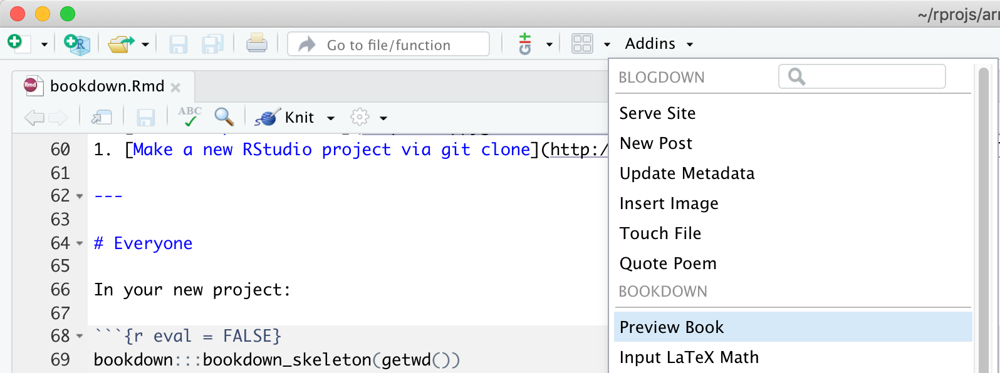
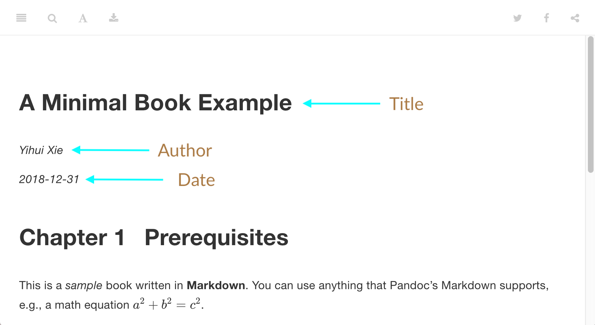

```{r setup, include=FALSE}
options(htmltools.dir.version = FALSE)
library(knitr)
knitr::opts_chunk$set(warning = FALSE, message = FALSE)
# options(knitr.table.format = "html")
library(tidyverse)
library(babynames)
library(fontawesome) # from github: https://github.com/rstudio/fontawesome
library(DiagrammeR)
```

layout: true
  
<div class="my-footer"><span>rstd.io/arm-bookdown</span></div>

<!-- this adds the link footer to all slides, depends on my-footer class in css-->

---
name: bookdown-title
background-image: url(img/karim-ghantous-333364-unsplash.jpg)
background-size: cover

# Meet bookdown


### .fancy[Making Books in R Markdown]

.large[Alison Hill | rstudio::conf | `r Sys.Date()`]

<!-- this ends up being the title slide since seal = FALSE-->


---
name: lifecycle

individual files:

.Rmd to .md (via knitr)

.md to HTML (via pandoc)


HTML to lots of HTML --> BOOK (via bookdown)

---
background-image: url(img/art-lasovsky-559569-unsplash.jpg)
background-size: cover

# Hello `r emo::ji("book")`


+ Multiple R Markdown documents

+ Multiple output formats (E-books, PDF, HTML websites...)

+ Formatting features like cross-referencing, numbering of figures, equations, and tables.


---

.left-column[
# Hello `r emo::ji("book")`
]

.right-column[
```{r echo = FALSE}
knitr::include_url("https://bookdown.org/yihui/bookdown/", height = "500px")
```
https://bookdown.org/yihui/bookdown/
]


???

We'll focus on the `gitbook` output format today, which renders your book to an HTML website.

Here is an example of what one looks like- from the bookdown book!

-> Show TOC here in window

---

.left-column[
# [The simplest book](https://minimal-bookdown.netlify.com/)


]

.right-column[
```{r echo = FALSE}
knitr::include_url("https://minimal-bookdown.netlify.com/", height = "500px")
```
https://minimal-bookdown.netlify.com/

]

???

This book was built from a single file, the index.Rmd file

It has a title, and author, and a single (very short) chapter called "Hello World"

You can also see it has one and only one output format: gitbook


---

# [The simplest book](https://minimal-bookdown.netlify.com/)

```yaml
---
title: "A Book"
author: "Frida Gomam"
site: bookdown::bookdown_site 
documentclass: book
output:
  bookdown::gitbook: default
  #bookdown::pdf_book: default
---
# Hello World

Hi.

Bye.
```

.footnote[
https://github.com/yihui/bookdown-minimal
]

???

The index.Rmd is the only file required to build a book. 

The site parameter is the only required one here, it must be bookdown::bookdown_site.

The first and only chapter is called "Hello World"

But it is unlikely you want to write a book this simple...

You'll probably want a few chapters, and some nice extra goodies.

---
class: inverse, middle, center

# `r emo::ji("book")`

# .fancy[Let's build a book right now]


---
class: inverse, middle

# Choose a workflow

--

.pull-left[

# .fancy[[New project, <i class="fab fa-github fa-lg fa-fw"></i> first](https://happygitwithr.com/new-github-first.html)]


1. Make a [repo on GitHub](https://happygitwithr.com/new-github-first.html#make-a-repo-on-github-1)

1. Make a [new RStudio project via git clone](https://happygitwithr.com/new-github-first.html#new-rstudio-project-via-git-clone)

1. Run:

```{r eval = FALSE}
bookdown:::bookdown_skeleton(getwd())
```

]

--

.pull-right[

# .fancy[.blue[New project only]]


1. Make a new RStudio project via wizard

    *File > New Project > New Directory > <br> `r emo::ji("book")` Book Project using bookdown*

]

---


### Project structure


```{r eval = FALSE}
directory/
├── .Rproj.user
├── book.Rproj
├── 01-intro.Rmd
├── 02-literature.Rmd
├── 03-method.Rmd
├── 04-application.Rmd
├── 05-summary.Rmd
├── 06-references.Rmd
├──  README.md
├── _bookdown.yml
├── _output.yml
├──  book.bib
├──  index.Rmd #<<
├──  preamble.tex
└──  style.css
```

???

You should all be looking at this directory structure. The index.Rmd again is the only required file here, with some specific YAML parameters set within it.

We'll walk through these elements as we go, and what they all do.


---

### Project structure


```{r eval = FALSE}
directory/
├── .Rproj.user
├── book.Rproj
├── 01-intro.Rmd  #<<
├── 02-literature.Rmd #<<
├── 03-method.Rmd #<<
├── 04-application.Rmd #<<
├── 05-summary.Rmd #<<
├── 06-references.Rmd #<<
├──  README.md
├── _bookdown.yml
├── _output.yml
├──  book.bib
├──  index.Rmd  #<<
├──  preamble.tex
└──  style.css
```


???

each chapter = an .Rmd file


---
class: inverse, middle, center

# `r emo::ji("book")`

# .fancy[Let's render our book right now]


---

# Choose a workflow

### Option 1: 
```{r eval = FALSE}
bookdown::render_book('index.Rmd')
```

--

### Option 2: 

```{r eval = FALSE}
bookdown::serve_book()
```

--

### Option 3: 

.fancy[.blue["Preview Book"]] Add-in (calls `bookdown::serve_book()`)


---

# Use Add-in


```{r echo = FALSE, out.width = '70%'}

```


---
name: first-preview

.left-column[
# Hello `r emo::ji("book")`
]

.right-column[


```{r echo = FALSE}
knitr::include_url("https://skeleton-bookdown.netlify.com/", height = "500px")
```
https://skeleton-bookdown.netlify.com/


]

???

Also the index.Rmd technically contains the first "chapter". Notice that in your rendered book, the second chapter is called "Introduction"- but the filename was 01-intro.Rmd. The prerequisites chapter, which is the first level-one heading in the index.Rmd became chapter 1.

I'll show you later how to change this if you want to.

---

### New files created


```{r eval = FALSE}
directory/
├── .Rproj.user
├── book.Rproj
├── 01-intro.Rmd
├── 02-literature.Rmd
├── 03-method.Rmd
├── 04-application.Rmd
├── 05-summary.Rmd
├── 06-references.Rmd
├──  README.md
├── _bookdown.yml
├── _output.yml
├──  book.bib
├──  index.Rmd  
├──  preamble.tex
├──  style.css
├──  _book #<<
├──  _bookdown_files #<<
└──  packages.bib  #<<
```


???

_book contains the generated book files- each .Rmd is saved as HTML files

_bookdown_files contains figure and cache files that were generated automatically from knitr

You could delete any of these and re-render your book to re-create them.


---

# `packages.bib`

This is a code chunk in `index.Rmd`

````
```{r include = FALSE}`r ''`
# automatically create a bib database for R packages
knitr::write_bib(c(
  .packages(), 'bookdown', 'knitr', 'rmarkdown'
), 'packages.bib')
```
````


---
name: clean
exclude: true

# Cleaning up


```{r eval = FALSE}
bookdown::clean_book()
```

```
These files/dirs can probably be removed: 

_book/

You can set options(bookdown.clean_book = TRUE) to allow 
this function to always clean up the book directory for you.
```


To do this:

```{r eval = FALSE}
bookdown::clean_book(TRUE)
```


.footnote[
this is the default setting (clean = TRUE) for `render_book`
]


---
name: outline

# Our bookdown plan

+ Preface: the [`index.Rmd`](#index-YAML) <a href="https://bookdown.org/yihui/rmarkdown/bookdown-project.html#index-file"><i class="fas fa-book"></i></a>

+ [The `_bookdown.yml`](#bookdown-YAML) <a href="https://bookdown.org/yihui/rmarkdown/bookdown-project.html#bookdown.yml"><i class="fas fa-book"></i></a>

+ [The chapters]() <a href="https://bookdown.org/yihui/rmarkdown/bookdown-project.html#rmd-files"><i class="fas fa-book"></i></a>

+ Postscript: the [`_output.yml`](#output-YAML) <a href="https://bookdown.org/yihui/rmarkdown/bookdown-project.html#output.yml"><i class="fas fa-book"></i></a>

---
name: section
class: middle, inverse
background-image: url(img/kelly-sikkema-450720-unsplash.jpg)
background-size: cover

---
name: index-YAML
template: section

.right-column[

# <i class="fas fa-feather-alt"></i>.fancy[Preface: <br>the `index.Rmd` file]
<br>
<br>
<br>
### .fancy["made before" (prae + factum)] 
[-wikipedia](https://en.wikipedia.org/wiki/Preface)
]


---

# `index.Rmd` = YAML


```yaml
--- 
title: "A Minimal Book Example"
author: "Yihui Xie"
date: "`r Sys.Date()`"
site: bookdown::bookdown_site
documentclass: book
bibliography: [book.bib, packages.bib]
biblio-style: apalike
link-citations: yes
description: "This is a minimal example..."
---
```

???

The `site` is **required**


---

# `index.Rmd` = YAML

.pull-left[
```yaml
--- 
title: "A Minimal Book Example" 
author: "Yihui Xie" 
date: "`r Sys.Date()`" 
site: bookdown::bookdown_site 
documentclass: book
bibliography: [book.bib, packages.bib]
biblio-style: apalike
link-citations: yes
description: "This is a minimal example..."
---
```
]

.pull-right[

```{r echo = FALSE}

```

]

---

# Additional `index.Rmd` YAML parameters

.pull-left[
Use [this link](https://github.com/rstudio/bookdown/blob/dda5f5a220058271a43ba8b81c6e6859ae3b9815/inst/templates/default.html) and find the title start/end (line 125):

```html
<!--bookdown:title:start-->
$if(title)$
<div id="$idprefix$header">
<h1 class="title">$title$</h1>
$if(subtitle)$
<h3 class="subtitle"><em>$subtitle$</em></h3>
$endif$
$for(author)$
$if(author.name)$
<h4 class="author"><em>$author.name$</em></h4>
$if(author.affiliation)$
<address class="author_afil">
$author.affiliation$<br>$endif$
$if(author.email)$
<a class="author_email" href="mailto:#">$author.email$</a>
...
<!--bookdown:title:end-->
```
]

.pull-right[

All of these are YAML parameters, for example:

```yaml
title: "A Minimal Book Example"
subtitle: "ARM workshop"
author: 
  name: Yihui Xie
  affiliation: RStudio
  email: xie@yihui.name
```


]

---
name: yourturn1
class: inverse, middle, center

# Your turn 

# `r emo::ji("clock")` 3 min

## .fancy[Edit your `index.Rmd` YAML, <br>and re-render your book]


---

# YAML = `<meta />` <i class="fas fa-tags"></i>

via Pandoc, see all possible YAML parameters [here](https://pandoc.org/MANUAL.html#epub-metadata)

```html
$if(url)$<meta property="og:url" content="$url$" />$endif$
$if(cover-image)$<meta property="og:image" content="$url$$cover-image$" />$endif$
$if(description)$<meta property="og:description" content="$description$" />$endif$
$if(github-repo)$<meta name="github-repo" content="$github-repo$" />$endif$
```

--

I recommend adding all of these!

```{r eval = FALSE}
cover-image: images/books.jpg # relative to index
url: 'https\://alison-bookdown.netlify.com/' 
github-repo: rstudio-education/arm-companion-rsc2019
```


.footnote[
https://bookdown.org/yihui/bookdown/usage.html
]

???

This explains why you won't see any changes when you add some YAML parameters to index.Rmd

The changes are fed to Pandoc to generate meta-data for your book website, but cover-image for example does not actually add a cover-image to your repo (try it!)


---
name: yourturn2
class: inverse, middle, center

# Your turn 

# `r emo::ji("clock")` 3 min

## .fancy[Add new YAML meta-data tags to your `index.Rmd`, <br>and re-render your book]

---

# Opinionated advice

.fancy[.blue[Problem:]] I want Chapter One = `01-intro.Rmd`

--

.fancy[.blue[Solution:]] Use an unnumbered header by appending `{-}` to it

--

Open `index.Rmd` and edit:
```{r eval = FALSE}
# Prerequisites {-}
```


.footnote[
1. https://github.com/rstudio/bookdown/issues/218
1. https://bookdown.org/yihui/bookdown/markdown-syntax.html#block-level-elements
]


---
name: pandoc-meta

```
<meta property="og:image" content="images/books.jpg">
<meta name="twitter:image" content="images/books.jpg">
<meta name="twitter:site" content="@hadley"> # from twitter-handle
```

For example:

https://cards-dev.twitter.com/validator

<i class="fas fa-link fa-lg fa-fw"></i> https://r4ds.had.co.nz/

<i class="fas fa-link fa-lg fa-fw"></i> https://moderndive.com/

<i class="fas fa-link fa-lg fa-fw"></i> https://bookdown.org/yihui/rmarkdown/

---
name: bookdown-YAML
template: section

.right-column[

# <i class="fas fa-feather-alt"></i>.fancy[Intro: <br>the `_bookdown.yml` file]

]


---

# Inside the `_bookdown.yml`

```{r eval = FALSE}
book_filename: "arm"
delete_merged_file: true #<<
language:
  ui:
    chapter_name: "Chapter "
```


---

# Configure **bookdown**

.pull-left[

```{r eval = FALSE}
book_filename: "arm"
delete_merged_file: true 
language:
  ui:
    chapter_name: "Chapter "
edit: https://github.com/apreshill/arm/edit/master/%s #<<
new_session: yes #<<
output_dir: "docs" # maybe?
```
]

--

.pull-right[
+ `edit`: add GitHub edit link?

+ `new_session`: render each chapter in its own R session?

+ `output_dir`: default = "_book"; "docs" if you want to publish to [GitHub Pages](https://blog.github.com/2016-08-17-simpler-github-pages-publishing/)
]

.footnote[
https://bookdown.org/yihui/bookdown/configuration.html
]

---

# this yaml gets fed to the `render_book` function

```{r eval = FALSE}
render_book = function(
  input, output_format = NULL, ..., clean = TRUE, envir = parent.frame(),
  clean_envir = !interactive(), output_dir = NULL, new_session = NA,
  preview = FALSE, encoding = 'UTF-8', config_file = '_bookdown.yml'
)
```


the default config file for the `bookdown::render_book()` function is `_bookdown.yml`

---
name: chapters
template: section

.right-column[

# <i class="fas fa-feather-alt"></i>.fancy[Story: <br>the chapter `.Rmd` files]

]

---
name: output-YAML
template: section

.right-column[

# <i class="fas fa-feather-alt"></i>.fancy[Postscript: <br>the `_output.yml` file]
<br>
<br>
<br>
### .fancy["written after"]
[Wikipedia](https://en.wikipedia.org/wiki/Postscript)
]

---

# GitBook configurations

```{r eval = FALSE}
gitbook_config = function(config = list()) {
  default = list(
    sharing = list(
      github = FALSE, facebook = TRUE, twitter = TRUE, google = FALSE,
      linkedin = FALSE, weibo = FALSE, instapaper = FALSE, vk = FALSE,
      all = c('facebook', 'google', 'twitter', 'linkedin', 'weibo', 'instapaper')
    ),
    fontsettings = list(theme = 'white', family = 'sans', size = 2),
    edit = list(link = NULL, text = NULL),
    history = list(link = NULL, text = NULL),
    download = NULL,
    # toolbar = list(position = 'static'),
    toc = list(collapse = 'subsection')
)
```

.footnote[
https://github.com/rstudio/bookdown/blob/master/R/gitbook.R
]

---


- go to https://github.com/mine-cetinkaya-rundel/thesisdowndss to view the README
- install package and load
- start new book using the RStudio GUI, making sure to name it index
- knit, and voila!
- observe how math text works, make changes, re-observe
- ex: add image, where should you save it? (a bit on using an external CDN like google images)
- how to do referencing
- how to do citations

---
notes to self:

to get twitter cards, in index.rmd need url and cover-image (pandoc)
to get github edit link, do edit in _bookdown.yml
to github repo link, do _output.yml, sharing github: yes; also need github-repo defined in index.Rmd

---

all the same

in the `index.Rmd`
```yaml
---
output:
  bookdown::gitbook:
    css: style.css
    highlight: kate
---
```

in the `_output.yml`
```yaml
bookdown::gitbook:
  css: style.css
  highlight: kate
```

---

all the same


all configurations for your output format go in the `_bookdown.yml`...

```yaml
edit:
  link: https://github.com/rstudio-education/arm-companion-rsc2019/edit/master/bookdown/alison-bookdown/%s
  text: "Edit"
download: ["pdf", "epub"]
```

but they can equally go in the `_output.yml`, 

```yaml
bookdown::gitbook:
  config:
    edit:
      link: https://github.com/rstudio-education/arm-companion-rsc2019/edit/master/bookdown/alison-bookdown/%s
      text: "Edit"
    download: ["pdf", "epub"]
```


