```{r setup, include=FALSE}
options(htmltools.dir.version = FALSE)
```

class: center, middle, inverse

## [http://bit.ly/extendRMD](http://bit.ly/extendRMD)

## [Exercises](https://github.com/haozhu233/rstudioconf19_arm_workshop_extending_rmd/raw/master/extRmd_exercises.zip)

<style>
@import url(https://fonts.googleapis.com/css?family=Yanone+Kaffeesatz);
@import url(https://fonts.googleapis.com/css?family=Droid+Serif:400,700,400italic);
@import url(https://fonts.googleapis.com/css?family=Source+Code+Pro:400,700);

body { font-family: 'Droid Serif', 'Palatino Linotype', 'Book Antiqua', Palatino, 'Microsoft YaHei', 'Songti SC', serif; }
h1, h2, h3 {
  font-family: 'Yanone Kaffeesatz';
  font-weight: normal;
}
.remark-code, .remark-inline-code { font-family: 'Source Code Pro', 'Lucida Console', Monaco, monospace; }
</style>

---

# Recap
- `Knit` button workflow

> R Markdown (.Rmd) -> knit() -> Markdown(.md) -> pandoc -> html, pdf, etc...


- knitr::knit_print(): *Define Custom Print method in rmarkdown for R class*

- knitr::asis_output(): *Render string (usually LaTeX/html) "asis" in rmarkdown*

- YAML options & Pandoc template: 
  - `html_document()` example
  - YAML options -> Pandoc options -> Pandoc template

- HTML & LaTeX dependencies

---

# In this session...

### Three Categories of R Markdown extensions

  - **Document elements that drop beyond the scope of markdown**
    - [kableExtra](https://github.com/haozhu233/kableExtra) & [gt](https://github.com/rstudio/gt)
    - [rmdWidgets](https://github.com/hebrewseniorlife/rmdWidgets)
  
  - **R Markdown templates**
    - [rticles](https://github.com/rstudio/rticles)
    - [memor](https://github.com/hebrewseniorlife/memor)
    
  - RStudio Addin & External Services to improve writing experience
    (we won't go through the details)
    - Reference management: [rcrossref](https://github.com/ropensci/rcrossref) + [citr](https://github.com/crsh/citr)
    - GIFs: [giphyr](https://github.com/haozhu233/giphyr)

---

class: middle, inverse

# Part #1. Beyond Markdown

---

# Markdown can't do everything

> Markdown is not a replacement for HTML, or even close to it. Its syntax is very small, corresponding only to a very small subset of HTML tags. The idea is not to create a syntax that makes it easier to insert HTML tags. In my opinion, HTML tags are already easy to insert. The idea for Markdown is to make it easy to read, write, and edit prose. HTML is a publishing format; Markdown is a writing format. Thus, **Markdown’s formatting syntax only addresses issues that can be conveyed in plain text**.
([Daring Fireball](https://daringfireball.net/projects/markdown/syntax#html))


- Markdown was not designed to solve everything. 

- Example: 
  - `r kableExtra::text_spec("Colored text is not something you can do with pure markdown.", color = "green")`
  - Complex tables: Second-level header, highlighted row etc.

---

class: middle, center

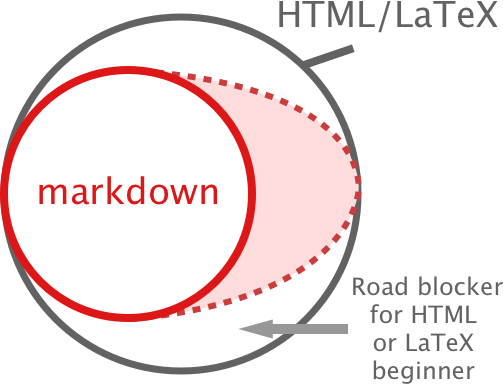

Gap includes: Complex tables, formatted texts, textbox, checkbox, etc
---

# kableExtra for Complex Tables 

- [`knitr::kable()`](https://github.com/yihui/knitr/blob/master/R/table.R) can generate tables in markdown(default), LaTeX, HTML, pandoc & rst.

- There is no way to format a markdown/pandoc table to publication quality. 

- `kableExtra` can modify the outputs of `kable` only when the format is LaTeX or HTML. 

- Design Logic: Use `kable` to generate a table first and then use a few functions to format different parts of the table.

- Detailed documentation:

  - [Documentation for HTML](https://haozhu233.github.io/kableExtra/awesome_table_in_html.html)
  - [Documentation for LaTeX](https://haozhu233.github.io/kableExtra/awesome_table_in_pdf.pdf)

---
class: middle, center

## <span style="color:red;">STOP!</span>

### PIPE CHECK!


---

# Sample kableExtra code

```{r, message=F}
library(kableExtra)

# HTML Table
mtcars[1:4, 1:4] %>%
  kable() %>%
  kable_styling() %>%
  add_header_above(c(" ", "RStudio" = 2, "Conf" = 2)) %>%
  group_rows("ARM workshop", start_row = 3, end_row = 4)
```

---

# Sample kableExtra code


```{r, message=F, eval = FALSE}
# LaTeX Table
mtcars[1:4, 1:4] %>%
  kable("latex", booktabs = T) %>%
  add_header_above(c(" ", "RStudio" = 2, "Conf" = 2)) %>%
  group_rows("ARM workshop", start_row = 3, end_row = 4) %>%
  kable_styling(latex_options = "striped") 
```

```{r echo = FALSE}
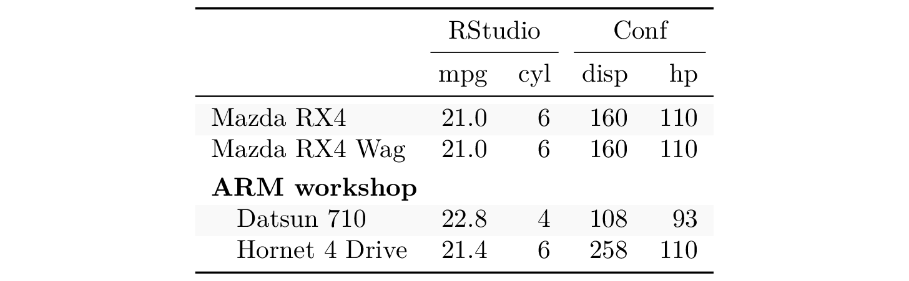
```

---

# Functions in kableExtra

- [`kable_styling`](https://www.rdocumentation.org/packages/kableExtra/versions/0.9.0/topics/kable_styling): Setups for general look of the entire table

- [`add_header_above`](https://www.rdocumentation.org/packages/kableExtra/versions/0.9.0/topics/add_header_above), [`group_rows`](https://www.rdocumentation.org/packages/kableExtra/versions/0.9.0/topics/group_rows), [`collapse_rows`](https://www.rdocumentation.org/packages/kableExtra/versions/0.9.0/topics/collapse_rows): Create a layout that shows selected rows/columns belong to one group

- [`column_spec`](https://www.rdocumentation.org/packages/kableExtra/versions/0.9.0/topics/column_spec), [`row_spec`](https://www.rdocumentation.org/packages/kableExtra/versions/0.9.0/topics/row_spec): Specify styles for selected rows/columns

- [`cell_spec`/`text_spec`](https://www.rdocumentation.org/packages/kableExtra/versions/0.9.0/topics/cell_spec): Generate raw HTML/LaTeX code for table or document texts.

- [`footnote`](https://www.rdocumentation.org/packages/kableExtra/versions/0.9.0/topics/footnote): Add table footnotes

- [`save_kable` & `as_image`](https://haozhu233.github.io/kableExtra/save_kable_and_as_image.html): Save HTML/LaTeX to HTML, PDF, PNG or JPG or use them as images in rmarkdown. 


---

# How tables look like in HTML

```{r}
x <- kable(mtcars[1:2, 1:2], "html")

attributes(x)
```

```{r}
cat(x)
```

---

# kableExtra uses xml2 for HTML table

- kableExtra uses [`xml2`](https://cran.r-project.org/web/packages/xml2/index.html) to read HTML table as XML and modify nodes as needed

```{r}
kableExtra:::read_kable_as_xml(x)
```

```{r}
x_xml <- x %>%
  kable_styling(bootstrap_options = "striped") %>%
  kableExtra:::read_kable_as_xml() 
x_xml
```

---

# kableExtra uses xml2 for HTML table

```{r}
library(xml2)

x_xml %>%           # table level
  xml_child(2) %>%  # Select tbody
  xml_child(1) %>%  # Select first row in body
  xml_child(1) %>%  # Select first column at first row
  xml_set_attr("style", "color: red;") # Adjust color through CSS
```

```{r}
kableExtra:::as_kable_xml(x_xml)
```

---

# Create new html node using htmltools

```{r}
library(htmltools)

simple_html_tag <- htmltools::tags$tr(list(
  htmltools::tags$td("a"), 
  htmltools::tags$td("b")
)) 

print(simple_html_tag)
```

```{r}
read_xml(as.character(simple_html_tag)) # Convert to xml node
```

---

# Exercise #1: Add a row to HTML table

### Add a row to the end of the table. This row has 3 cells "RStudio", "Conf", "2019". 

[Exercise Bundle](https://github.com/haozhu233/rstudioconf19_arm_workshop_extending_rmd/raw/master/extRmd_exercises.zip)

```{r, eval= F}
library(kableExtra)
library(xml2)
quiz1 <- kable(mtcars[1:2, 1:2], "html") %>% 
  kable_styling(full_width = F)
quiz1_xml <- kableExtra:::read_kable_as_xml(quiz1)
new_row <- c("RStudio", "Conf", "2019")
# You Start Here ---
```

1. HTML Table 101
  - HTML table is created **by row**. 
  - `<table>` -> `<thead>` -> `<tr>` (Row) -> `<th>` (Table Header Cell)
  - `<table>` -> `<tbody>` -> `<tr>` (Row) -> `<td>` (Table Body Cell)
1. Use `xml2::xml_add_child` to add a child xml to `<tbody>`

---

# Exercise #1: Add a row to HTML table

```{r}
library(kableExtra); library(xml2)
quiz1 <- kable(mtcars[1:2, 1:2], "html") %>% 
  kable_styling(full_width = F)
quiz1_xml <- kableExtra:::read_kable_as_xml(quiz1)
new_row <- c("RStudio", "Conf", "2019")
# You Start Here ---
new_row_html <- lapply(new_row, htmltools::tags$td) %>%
  htmltools::tags$tr() %>%
  as.character() %>%
  read_xml()
quiz1_xml %>%
  xml_child(2) %>%
  xml_add_child(new_row_html)
kableExtra:::as_kable_xml(quiz1_xml)
```

---

# Custom Print methods for kable

- `knitr::knit_print` allows us to define custom print methods in rmarkdown
  - [Original `knitr::kable()`'s `knit_print`](https://github.com/yihui/knitr/blob/2814058da5f83941862813928e78e79245fdc93d/R/table.R#L214-L219)
  
```{r, eval = F}
knit_print.knitr_kable = function(x, ...) {
  x = paste(c(
    if (!(attr(x, 'format') %in% c('html', 'latex'))) c('', ''), x, '\n'
  ), collapse = '\n')
  asis_output(x)  
}
```

`asis_output()` puts down the string "asis" in rmarkdown

---

# What about live preview for HTML tables in R console?

--

Yes! A regular `print` method!

[`kableExtra` example](https://github.com/haozhu233/kableExtra/blob/7c39cba444c60c2892b26b723f4d68b418b57078/R/print.R#L2-L14)

```{r, eval = F}
print.kableExtra <- function(x, ...) {
  html_header <- htmltools::tags$head(
    rmarkdown::html_dependency_jquery(),
    rmarkdown::html_dependency_bootstrap(theme = "simplex"),
    html_dependency_kePrint()
  )
  html_table <- htmltools::HTML(as.character(x))
  html_result <- htmltools::tagList(html_header, html_table)
  if (interactive() & rstudioapi::isAvailable()) {
    htmltools::html_print(html_result, viewer = rstudioapi::viewer)
  }
}
```

---

class: middle, center

# Questions?

---

# LaTeX tables

```{r}
sample_latex <- kable(mtcars[1:2, 1:2], "latex", booktabs = T)
print(sample_latex)
```

---

# LaTeX tables

- `kableExtra` uses regex to understand and modify LaTeX tables. 

```{r}
kableExtra::magic_mirror(sample_latex)
```

---

# When you use regex with LaTeX...

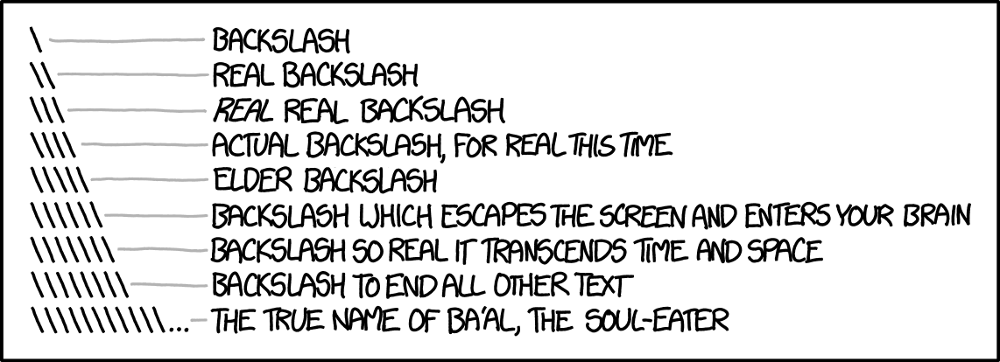

[xkcd](https://xkcd.com/1638/)

### Anyway, thanks to everyone who reported bugs on github, this methodology is still working. 
---

# Managing LaTeX dependency through code

- Like R, in LaTeX, people use `\usepackage{}` to load packages
- Most advanced features for tables (and other things) in LaTeX relies on these packages. For example: `booktabs`, `longtable`, `xcolor`...

- Most R table packages require users to put `\usepackage{}` in `includes` by themselves. However, for LaTeX beginners...


---

# Managing LaTeX dependency through code

- If you know your users need packages like `xcolor` or `booktabs`, load the packages for them!

[kableExtra Example](https://github.com/haozhu233/kableExtra/blob/7c39cba444c60c2892b26b723f4d68b418b57078/R/util.R#L24-L26)

```{r, eval=F}
usepackage_latex <- function(name, options = NULL) {
  invisible(knitr::knit_meta_add(
    list(rmarkdown::latex_dependency(name, options))
  ))
}

usepackage_latex("booktabs")
```

By combining [`knitr::knit_meta_add`](https://www.rdocumentation.org/packages/knitr/versions/1.20/topics/knit_meta) and [`rmarkdown::latex_dependency`](https://www.rdocumentation.org/packages/rmarkdown/versions/1.10/topics/latex_dependency), you can pass the latex package information to `rmarkdown::meta_data`, which will then be loaded into document right before `body`. 

---

# Cross-format Tables - Approach #1

- Let `kable` determine output format automatically
  - Inside a rmarkdown -> PDF session, kableExtra will set global option `knitr.table.format` as "latex". Otherwise, let's go with html. :)
  - Useful in bookdown or cases where users need to render to different formats at the same time. 
  - This code below will produce a table work in both HTML & LaTeX. 

```{r, eval = F}
mtcars[1:2, 1:2] %>%
  kable(booktabs = T) %>%
  kable_styling(
    bootstrap_options = "striped", 
    latex_options = "striped"
  ) %>%
  column_spec(1, bold = T)
```

---

# Cross-format Tables - Approach #2

- Render tables as graphics?
  - `save_kable` can save HTML/LaTeX tables to files as html, pdf, png, jpg...
  - `as_image` calls `save_kable` internally, renders a png and includes the png as graphics in rmarkdown
  
- For LaTeX tables (Workflow ispired by [texPreview](https://github.com/metrumresearchgroup/texPreview))
 
  1. Render a standalone PDF snippet
  2. Use [magick](https://cran.r-project.org/package=magick) to readin
  3. Convert to image
  
- For HTML tables
 
  1. Render HTML to a file
  2. Use [webshot](https://cran.r-project.org/web/packages/webshot/index.html) to take a screenshot of the page
  3. Use [magick](https://cran.r-project.org/package=magick) to adjust if available. 


---

# gt from RStudio

- [Project Page](https://github.com/rstudio/gt) 
- A cleaner approach - Instead of modifying existing table code, it defines an object that contains information and renders it out when necessary
- Great integration with `tidyverse`
- Comes with its own CSS for HTML

```{r}
library(gt)

gt_example <- mtcars[1:3, 1:4] %>%
  tibble::rownames_to_column() %>%
  gt() 
gt_example
```

---

# More gt

```{r}
mtcars[1:3, 1:4] %>%
  tibble::rownames_to_column() %>%
  dplyr::group_by(cyl) %>%
  gt() %>%
  fmt_currency(vars(mpg))
```

---

# Combine gt with kableExtra

Certainly possible (in the future), at least for HTML. 

```{r}
gt2k <- function(x) {
  out <- gt::as_raw_html(x)
  attr(out, "format") <- "html"
  return(out)
}
gt_example %>%
  gt2k() %>%
  column_spec(3, color = "red", bold = T, italic = T) %>%
  group_rows("Test", 2, 3, 
             label_row_css = "background-color: gray;color:white;padding-left: 10px;")
```

---

# Other than table..

- checkbox from [rmdWidgets](https://github.com/hebrewseniorlife/rmdWidgets)

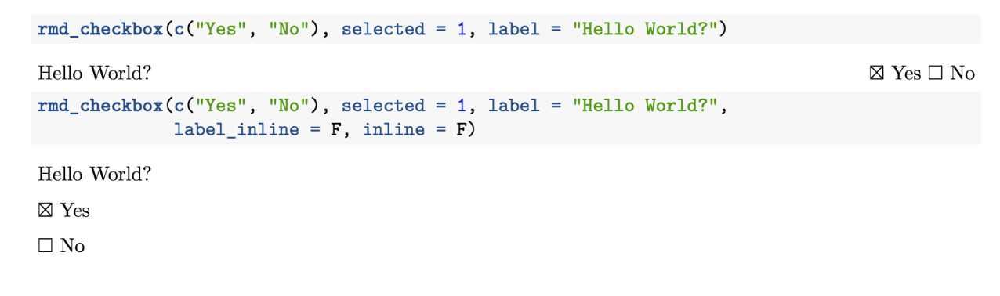

(This package is still in proof-of-concept stage.)

---

class: middle, center

# Questions?

---


class: middle, inverse

# Part #2. R Markdown Templates

---

# R Markdown Template Basics

- R Markdown Template is more than stylesheet!!
  - It's a bundle of stylesheet, document content skeleton, citation info & other misc files (such as logo images)

- For different formats
  - LaTeX: LaTeX template file
  - HTML: css and javascript
  - Word: Word reference files

- There are about 60 ~ 70 templates on CRAN but a lot others on github only
  - How do I know?

---

# Template packages you should know

- LaTeX template
  - [**rticles**](https://github.com/rstudio/rticles)
  - [**memor**](https://github.com/hebrewseniorlife/memor)
  - [papaja](https://raw.githubusercontent.com/crsh/papaja/master/example/example.pdf)
  - [vitae](https://github.com/ropenscilabs/vitae)

- HTML template
  - [radix](https://rstudio.github.io/radix/)
  - [prettydoc](http://yixuan.cos.name/prettydoc/themes.html)
  - [xaringan](https://github.com/yihui/xaringan)
  - [flexdashboard](https://github.com/rstudio/flexdashboard)
  - [rmdformats](https://github.com/juba/rmdformats)
  
- Mixed Formats
  - [tufte](https://github.com/rstudio/tufte)
  - [rmdTemplates](https://github.com/Pakillo/rmdTemplates)

---

# Template Package Structure

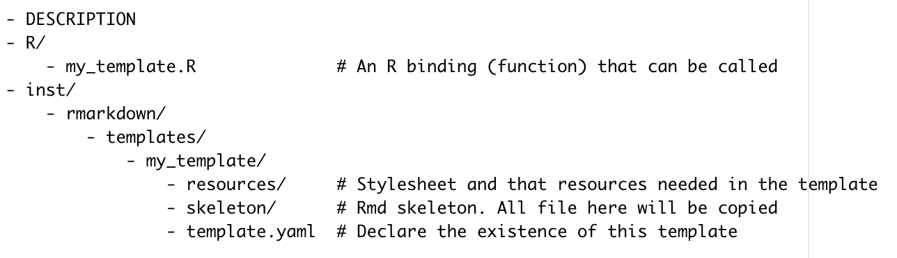

- All files in skeleton will be copied to users folder. 
- All files in resources are supposed to be called by either R or the template itself at least once
- [How many rmarkdown templates are there on CRAN?](https://github.com/search?p=1&q=org%3Acran+filename%3Atemplate.yaml&type=Code)

---

# rticles: LaTeX Journal Article Template

.pull-left[
- [ACM](http://www.acm.org/) articles
- [ACS](http://pubs.acs.org/) articles
- [AEA](https://www.aeaweb.org/journals/policies/templates) journal submissions
- [AMS](https://www.ametsoc.org/) articles
- [Biometrics](http://www.biometrics.tibs.org/) articles
- [Bulletin de l'AMQ](https://www.amq.math.ca/bulletin/) journal submissions
- [CTeX](http://ctex.org) documents
- [Elsevier](https://www.elsevier.com) journal submissions
- [IEEE Transaction](http://www.ieee.org/publications_standards/publications/authors/author_templates.html) journal submissions
- [JSS](http://www.jstatsoft.org/) articles
- [MDPI](http://www.mdpi.com) journal submissions
]

.pull-right[
- [Monthly Notices of the Royal Astronomical Society](https://academic.oup.com/mnras) articles
- [NNRAS](https://www.ras.org.uk/news-and-press/2641-new-version-of-the-mnras-latex-package) journal submissions
- [PeerJ](https://peerj.com) articles
- [Royal Society Open Science](http://rsos.royalsocietypublishing.org/) journal submissions
- [Sage](https://uk.sagepub.com/en-gb/eur/manuscript-submission-guidelines) journal submissions
- [Springer](https://www.springer.com/gp/livingreviews/latex-templates) journal submissions
- [Statistics in Medicine](http://onlinelibrary.wiley.com/journal/10.1002/(ISSN)1097-0258/homepage/la_tex_class_file.htm) journal submissions
- [Copernicus Publications](https://publications.copernicus.org) journal submissions
- [The R Journal](https://journal.r-project.org/) articles
]

---

class: middle

### Example: Create a Springer journal submission

---

# Let's take a closer look

- inst/rmarkdown/templates/springer_article/template.yaml

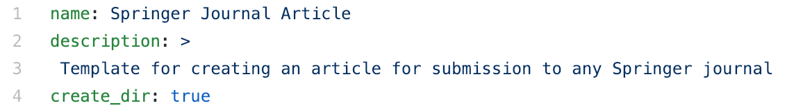

create_dir Rule of Thumb: 

If you have more than 1 additional files other than skeleton.Rmd in the skeleton folder, you should set create_dir to be true

- [inst/rmarkdown/templates/springer_article](https://github.com/rstudio/rticles/tree/master/inst/rmarkdown/templates/springer_article)

- [R/springer_article.R](https://github.com/rstudio/rticles/blob/master/R/springer_article.R)


---

```{r}
rmarkdown::pdf_document()
```

---

# The Golem of R Markdown Template

.pull-left[
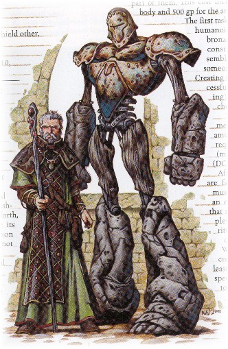
]

.pull-right[

- skeleton folder: Bone

- resources: Blood & Muscle

- R function: Magic Spell

- template.yaml: "True name"

[Image Credit](http://biology.kenyon.edu/slonc/bio3/2001projects/Golems/bibliography.html)


]

---

class: middle, center

# Questions?

---

# Let's look even closer at the template file

- [Springer template.tex](https://github.com/rstudio/rticles/blob/master/inst/rmarkdown/templates/springer_article/resources/template.tex)
- What are these?
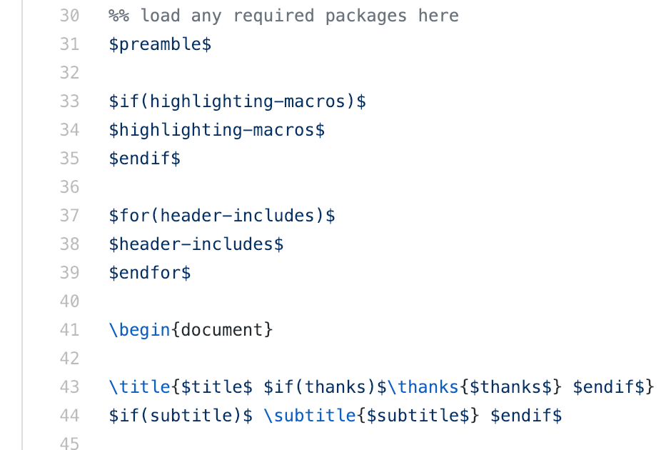

---

# Programming with Pandoc variable

- [Pandoc's Official Documentation](https://pandoc.org/MANUAL.html#variables-set-by-pandoc)
- Basic Syntax
  - Quote variables in a pair of $
  - `$if()$...$endif$`
  - `$for()$...$endfor$`
- How does Pandoc know these variables we set in Rmarkdown?
  - Recap
      - R Markdown (.Rmd) -> knit() -> Markdown(.md) -> pandoc -> html, pdf, etc...
      - YAML options -> Pandoc options -> Pandoc template
  - How exactly? **(Tricky)**
      - Pandoc processes .md which has those yaml variable and use them with template. 
      - rmarkdown processes information and pass them as arguments and variables to pandoc through a system call
      
[Source code for pdf_document](https://github.com/rstudio/rmarkdown/blob/master/R/pdf_document.R)

---

# You can see this system call in your console

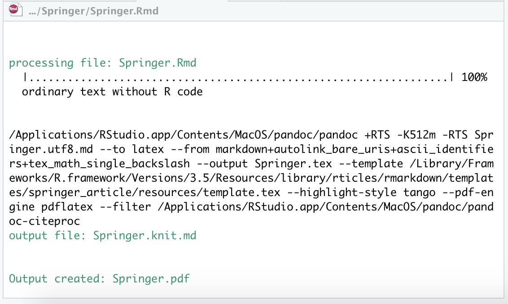

---

### Exercise #2: Create a pdf_document-like template can allow users to put in some description after title.

[Exercise bundle](https://github.com/haozhu233/rstudioconf19_arm_workshop_extending_rmd/raw/master/extRmd_exercises.zip) 

**Tips:**
- For simplicity, please use the Pandoc approach. **In this case, the only file you only need to modify is template.tex.**  
- Right after title is the place where you put the description. 
- You need to build your package to let it work. Raise your hand if you have questions. 

![img/extend-img/pandoc_hint.png]

---

## How about the second approach? (more advanced)

- Here you need to do two things: 
  - Create a new document function that inherits `pdf_document` and send session info as part of Pandoc Arguments
  - Mark where you want to put this pandoc argument in `template.tex`
- You can find all the current pandoc variables in `pdf_document()$pandoc$args`
- In addition, you can add items to this vector.
- You can use `rmarkdown::pandoc_variable_arg()` to generate a valid pandoc argument

For example, if I want to pass `event` from R to pandoc as a variable also called "event"

```{r}
out <- rmarkdown::pdf_document()

event <- "RStudio Conf 2019"
event_pandoc <- rmarkdown::pandoc_variable_arg(
  "event", event
)

out$pandoc$arg <- c(out$pandoc$arg, event_pandoc)
```

---

# memor: Customizable memo in R Markdown

- [Project Page](https://github.com/hebrewseniorlife/memor) & [demo document](https://hebrewseniorlife.github.io/memor/demo.pdf)

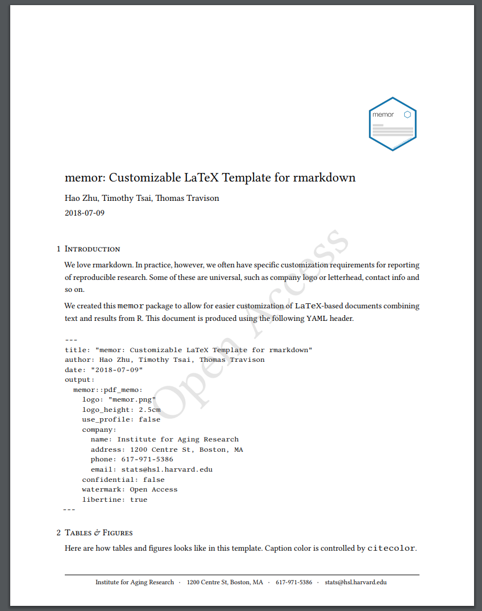

---

## Many elements are customizable with memor

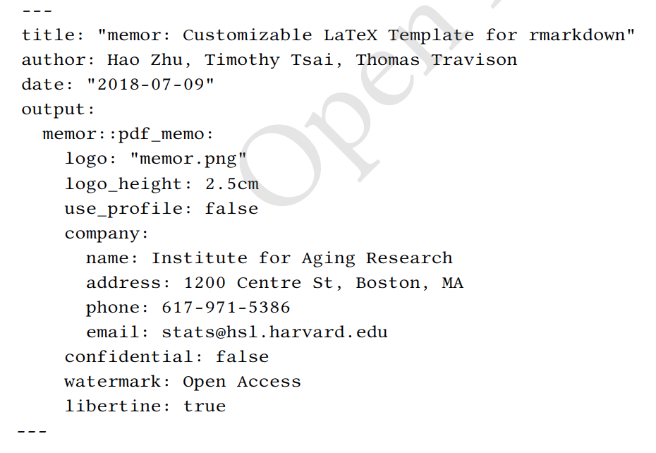

---

## memor profile

- You don't want to have a long yaml section in every document, right?
- You can save information of your school/workplace separately.
- And controlled with an RStudio Addin!

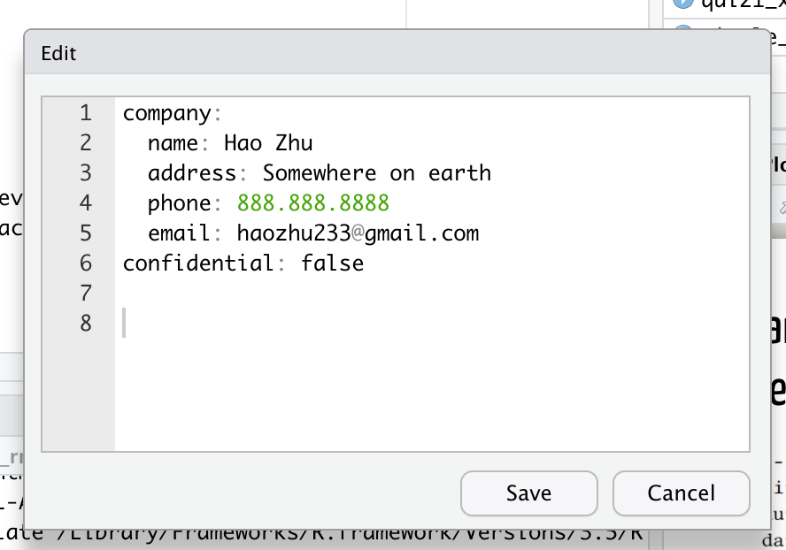

---

## Word Templates

- R Markdown Word Templates can either bundle with a package or be standalone as a template reference file
- Good Resources to learn:
  - [R Markdown: The Definitive Guide Chap 17](https://bookdown.org/yihui/rmarkdown/document-templates.html)
  - [Happy collaboration with Rmd to docx](https://rmarkdown.rstudio.com/articles_docx.html)
  - [A Coursera course video from Emory by Melinda Higgins](https://www.coursera.org/lecture/reproducible-templates-analysis/customizing-a-word-document-idnEf)
  - [Create A MS Word Template for R Markdown](https://vimeo.com/110804387)
  - [rmdTemplates](https://github.com/Pakillo/rmdTemplates)

## Bookdown Template?

- [The First Bookdown Contest](https://community.rstudio.com/t/announcing-winners-of-the-1st-bookdown-contest/16394)

---

class: middle, center

# Questions?

---

class: middle, inverse

## Part #3. RStudio Addins for better writing experience

---

## Reference Management in R Markdown

- [rcrossref](https://github.com/ropensci/rcrossref) allows you to search articles and download their bibtex
- [citr](https://github.com/crsh/citr) allows you to add citation from the bibtex

## Insert GIF to R Markdown

- [giphyr](https://github.com/haozhu233/giphyr)

---

class: middle, center

### Thanks!
