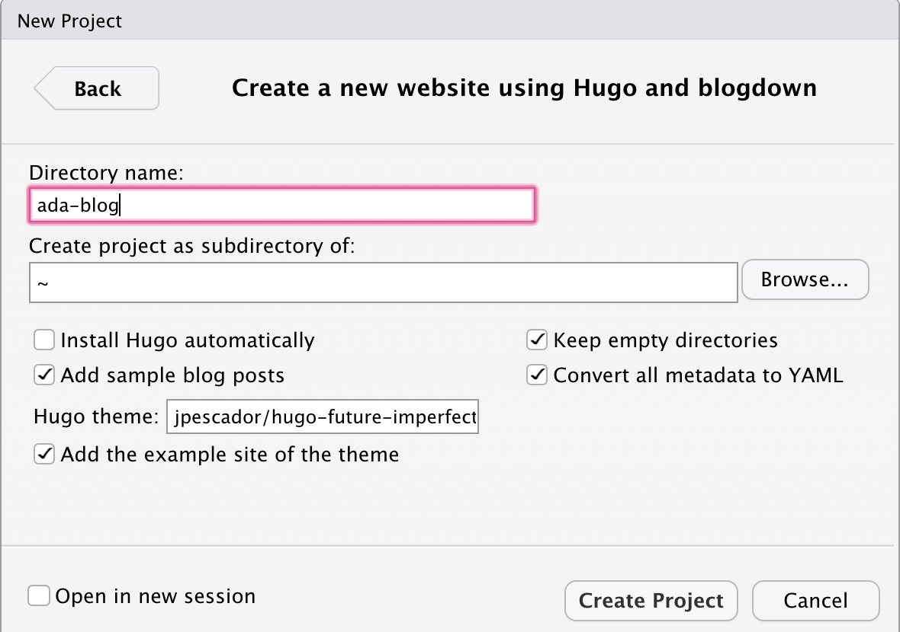

```{r setup, include=FALSE}
options(htmltools.dir.version = FALSE)
library(knitr)
knitr::opts_chunk$set(warning = FALSE, message = FALSE, fig.align = "center", out.width = "80%")
# options(knitr.table.format = "html")
library(tidyverse)
library(fontawesome) # from github: https://github.com/rstudio/fontawesome
```

layout: true
  
<div class="my-footer"><span>bit.ly/flexdashboard-rsconf19</span></div>

<!-- this adds the link footer to all slides, depends on my-footer class in css-->

---
name: flexdashboard-title
background-image: url(img/fer-gomez-1164907-unsplash.jpg)
background-size: cover
class: inverse

# `r rmarkdown::metadata$subtitle`

<br>
<br>
<br>
<br>
<br>
<br>
<br>
<br>
<br>
<br>
<br>
<br>

### .fancy[`r rmarkdown::metadata$title`]

.large[`r rmarkdown::metadata$author` | rstudio::conf | `r Sys.Date()`]

<!-- this ends up being the title slide since seal = FALSE-->

---

class: inverse, middle, center

# .fancy[Build a dashboard for [The Great British Bake Off](https://en.wikipedia.org/wiki/The_Great_British_Bake_Off)]

```{r echo = FALSE, out.width='50%'}
knitr::include_graphics("https://thegreatbritishbakeoff.co.uk/wp-content/uploads/2018/09/TENT-BAKERS-1024x450.png")
```


--

.pull-left[
### .fancy[.center[Local with GitHub]]
### .fancy[.center[`r emo::ji("computer")` + <i class="fab fa-github fa-lg fa-fw"></i>]]
]

--

.pull-right[
### .fancy[.center[Cloud or Local (no GitHub)]]
### .fancy[.center[`r emo::ji("cloud")` | `r emo::ji("computer")`]]
]


---
name: start-here
class: inverse, middle

.pull-left[
### .fancy[.center[Local with GitHub]]
### .fancy[.center[`r emo::ji("computer")` + <i class="fab fa-github fa-lg fa-fw"></i>]]


1. Make a [repo on <i class="fab fa-github fa-lg fa-fw"></i>GitHub](https://happygitwithr.com/new-github-first.html#make-a-repo-on-github-1)

1. Make a [new RStudio project via git clone](https://happygitwithr.com/new-github-first.html#new-rstudio-project-via-git-clone) <br>
    *File > New Project > Version Control > Git*

1. Run:

```{r eval = FALSE}
library(blogdown)
new_site(theme = "jpescador/hugo-future-imperfect", 
         sample = TRUE, 
         theme_example = TRUE, 
         empty_dirs = TRUE,
         to_yaml = TRUE)
```

]

.pull-right[
### .fancy[.center[Cloud or Local]]
### .fancy[.center[`r emo::ji("cloud")` | `r emo::ji("computer")`]]


1. Make a new RStudio project via wizard <br> 
    *File > New Project > New Directory*

1. Scroll down to select: <br>
     *Website using blogdown*

```{r echo = FALSE, out.width='80%'}

```


]


???

if an exampleSite exists, it will be in themes/<hugo-future-imperfect>/exampleSite

---
## YAML header

    ---
    title: "Flex Dashboard"
    output: flexdashboard::flex_dashboard
    ---
    
    
---
## The Big Idea

- Use Markdown headings to describe the boxes and space division of your dashboard
    - Layout is implicit and automatic
    - Tweakable with custom attributes
- Content in your boxes fills the box automatically
- Supply gaps between R offerings and common dashboard components

---
name: block1
class: middle, center, inverse

# `r emo::ji("cake")`

# Layouts

.footnote[
https://bookdown.org/yihui/rmarkdown/layout.html
]
---
name: layouts-boxes

# Level three: boxes


    ### This is a box. 
    
    This is some text in the box.
  


---
name: layouts-columns

# Level two: columns


    ## My first column
    
    ### My first box
    
    This is some text in a box.
    
    ## My second column
    
    ### My second box
    
    This is some slightly different text in a box.

---

# Level two: columns


---
name: layouts-pages

# Level one: pages

    # Page one
    
    ### My first box
    
    This is some text in a box.
    
    # Page two
    
    ### My second box
    
    This is some slightly different text in a box.

---

# Level one: pages


---
## Layout Recap:

- flexdashboards are composed of space-filling boxes created with level 3 headers (`###`)
- Boxes can be grouped into columns (or rows, or tabs) with level 2 headers (`##`)
- Pages can group other kinds of components
- Much more advanced layout is possible (see docs for details)

---
name: yourturn
background-image: url(img/joanna-kosinska-288950-unsplash.jpg)
background-size: cover
class: middle


# <i class="fas fa-edit"></i> .fancy[Your turn]


---
name: yourturn-1
template: yourturn


# .fancy[03:00 minutes]

## Make a new `flexdashboard` with some layouts like:

+ [Boxes](#layouts-boxes)

+  [Columns](#layouts-columns)

+ [Pages](#layouts-pages)


---
name: block2
class: middle, center, inverse

# `r emo::ji("cake")`

# Components

.footnote[
https://bookdown.org/yihui/rmarkdown/dashboard-components.html
]

---

## Plots and HTML widgets

- Any R graphics are supported
- Graphs and visualizations: the basic building blocks of most dashboards
- Contents automatically scaled to the size of the box
- HTML widgets can include interactivity 

---
## Plots and HTML widgets

    ### Iris data
    
```{r, echo = FALSE, results="asis"}
cat("    ```{r}",
    "    qplot(Sepal.Length, Petal.Length, data = iris, color = Species)",
    "    ```", sep = "\n")
```
    
    ### Birthplace of R

```{r, echo = FALSE, results="asis"}
cat("    ```{r}",
    "    library(leaflet)",
    "    m <- leaflet() %>%",
    "      addTiles() %>% ",
    "      addMarkers(lng=174.768, lat=-36.852, popup=\"The birthplace of R\")", 
    "    ```",
    sep = "\n")
```

---
## Plots and HTML widgets


---
## Value boxes

```{r, eval=FALSE}
library(flexdashboard)
articles <- 204
valueBox(articles, 
         icon = "fa-pencil", 
         caption = "Articles per Day")
```


---
## Gauges
 
```{r, eval=FALSE}
satisfaction <- 86
gauge(satisfaction, min = 0, max = 100, symbol = '%', 
  label = "Satisfaction", gaugeSectors(
  success = c(80, 100), warning = c(40, 79), danger = c(0, 39)
))
```


---
## Including Data: tabsets

    ## Column {.tabset}
     
    ### Chart 

```{r echo=FALSE, results='asis'}
cat(paste("    ```{r}",
          "    qplot(Sepal.Length, Petal.Length, data = iris, color = Species) ", 
          "    ```", sep = "\n"))
```
    
    ### Data
    
```{r echo=FALSE, results='asis'}
cat(paste("    ```{r}",
          "    knitr::kable(iris)", 
          "    ```", sep = "\n"))
```
    
---
## Including Data: Chart


---
## Including Data: Table


---

`{.tabset .tabset-dropdown}`

```
# R Markdown {.tabset .tabset-dropdown}

## Tab A

This is an R Markdown document. 

## Tab B

When you click the **Knit** button a document will be generated.

## Tab C

Here is a summary table.

```{r cars}
summary(cars)
```
```

---
name: block3
class: middle, center, inverse

# `r emo::ji("cake")`

# Interactive Dashboards

.footnote[
https://bookdown.org/yihui/rmarkdown/interactive-documents.html#intro-widgets
]

---
## Interactivity with HTML widgets

- Simplest form of interactivity
- Static HTML; no special client or server requirements
    - Host anywhere, view anywhere
- Data must be fixed (can't run R code)
- Interaction within single widget only 
    - Most widgets don't talk to each other (yet)

---
## HTML widget interactivity

```{r, eval=FALSE}
library(dygraphs)
lungDeaths <- cbind(mdeaths, fdeaths)
dygraph(lungDeaths) %>% 
   dyRangeSelector()
```

---
## HTML widget interactivity 

```{r, echo=FALSE}
library(dygraphs)
lungDeaths <- cbind(mdeaths, fdeaths)
dygraph(lungDeaths) %>% 
   dyRangeSelector()
```

---
## flexdashboard vs. shinydashboard

- Static host vs. Shiny Server (or shinyapps.io)
- Simplicity vs. complexity
- Constraints vs. flexibility

---
## Advanced topics

- Layout tweaking: adjust column widths/sizes
- Mobile friendliness
   - Largely automatic but can show/hide specifically
- Storyboards
- Navigation

---
# Wrap - up / Q & A

---
## Links

    https://github.com/jmcphers/flexdashboard-talk

- [flexdashboard documentation](http://rmarkdown.rstudio.com/flexdashboard/)
- [HTML widget crosstalk](https://github.com/rstudio/crosstalk)
- [HTML widget showcase](http://www.htmlwidgets.org/showcase_leaflet.html)

