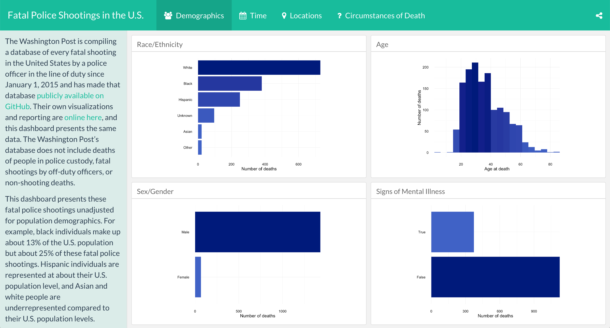
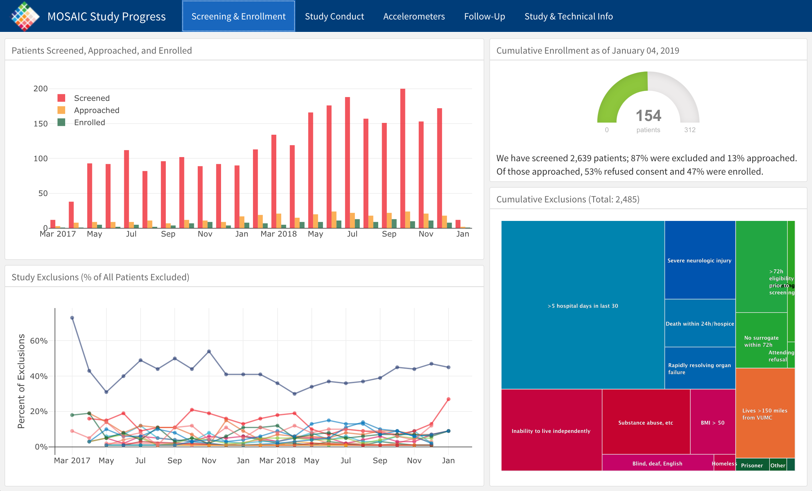
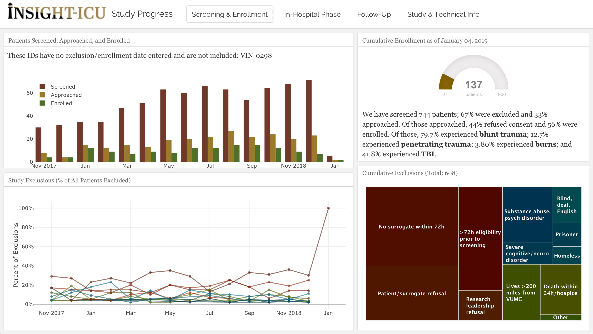
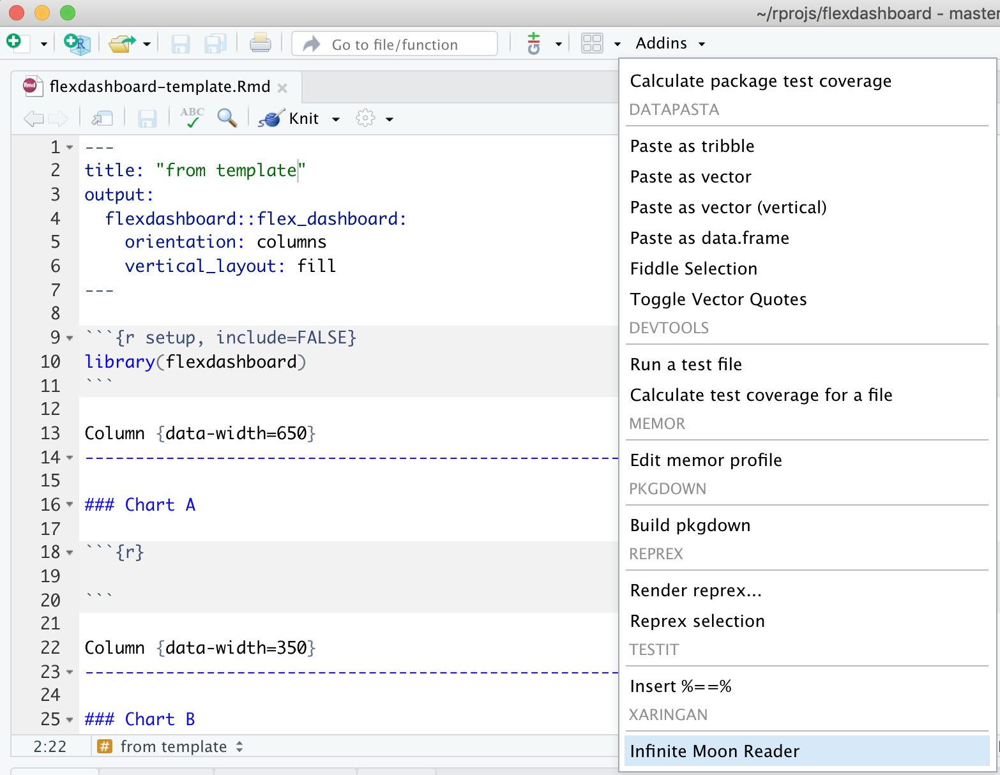
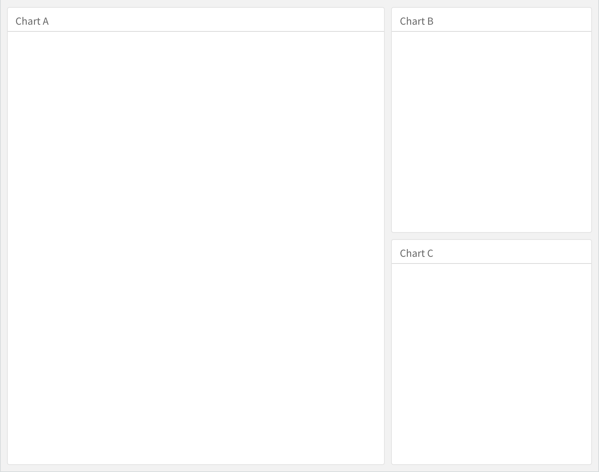
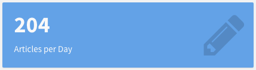
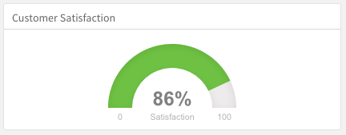

```{r setup, include=FALSE}
options(htmltools.dir.version = FALSE)
library(knitr)
knitr::opts_chunk$set(warning = FALSE, message = FALSE, fig.align = "center", out.width = "80%")
# options(knitr.table.format = "html")
library(tidyverse)
library(fontawesome) # from github: https://github.com/rstudio/fontawesome
library(bakeoff)
library(flexdashboard)
#remotes::install_github("apreshill/bakeoff")
```

layout: true
  
<div class="my-footer"><span>arm.rbind.io/slides/flexdashboard</span></div>

<!-- this adds the link footer to all slides, depends on my-footer class in css-->

---
name: flexdashboard-title
background-image: url(img/fer-gomez-1164907-unsplash.jpg)
background-size: cover
class: inverse

# `r rmarkdown::metadata$subtitle`

<br>
<br>
<br>
<br>
<br>
<br>
<br>
<br>
<br>
<br>
<br>
<br>

### .fancy[`r rmarkdown::metadata$title`]

.large[`r rmarkdown::metadata$author` | rstudio::conf | `r Sys.Date()`]

<!-- this ends up being the title slide since seal = FALSE-->


---
class: middle, inverse, center


```{r echo = FALSE}

```

--

.footnote[

By [Julia Silge](https://juliasilge.com/) ([blog](https://juliasilge.com/blog/fatal-shootings/); [flexdashboard](https://beta.rstudioconnect.com/juliasilge/policeshooting/policeshooting.html); [source code](https://gist.github.com/juliasilge/9acbe97c549502bac85404779edceba0))
]

---
class: middle, inverse, center

```{r echo = FALSE, out.width='70%'}

```

--

.footnote[

By [Jennifer Thompson](https://jenthompson.me)
([blog](https://jenthompson.me/2018/02/09/flexdashboards-monitoring/);  [dashboard](https://jenthompson.me/examples/progressdash.html); [source code](https://github.com/jenniferthompson/MOSAICProgress))

]

---
class: middle, inverse, center

```{r echo = FALSE, out.width='70%'}

```

--

.footnote[

By [Jennifer Thompson](https://jenthompson.me) ([dashboard](https://jenthompson.me/examples/insight_progress.html); [source code](https://github.com/jenniferthompson/INSIGHTProgress))

]


---

# How does it work?

- Use Markdown headings to describe the boxes and space division of your dashboard

    - Layout is implicit and automatic
    - Tweakable with custom attributes
    
--

- Content in your boxes fills the box automatically

--

- Supply gaps between R offerings and common dashboard components

---

class: inverse, middle, center

# .fancy[Build a dashboard for [The Great British Bake Off](https://en.wikipedia.org/wiki/The_Great_British_Bake_Off)]

```{r echo = FALSE, out.width='50%'}
knitr::include_graphics("https://thegreatbritishbakeoff.co.uk/wp-content/uploads/2018/09/TENT-BAKERS-1024x450.png")
```


--

.pull-left[
### .fancy[.center[Local with GitHub]]
### .fancy[.center[`r emo::ji("computer")` + <i class="fab fa-github fa-lg fa-fw"></i>]]
]

--

.pull-right[
### .fancy[.center[Cloud or Local (no GitHub)]]
### .fancy[.center[`r emo::ji("cloud")` | `r emo::ji("computer")`]]
]


---
name: start-here
class: inverse, middle

.pull-left[
### .fancy[.center[Local with GitHub]]
### .fancy[.center[`r emo::ji("computer")` + <i class="fab fa-github fa-lg fa-fw"></i>]]


1. Make a [repo on <i class="fab fa-github fa-lg fa-fw"></i>GitHub](https://happygitwithr.com/new-github-first.html#make-a-repo-on-github-1)

1. Make a [new RStudio project via git clone](https://happygitwithr.com/new-github-first.html#new-rstudio-project-via-git-clone) <br>
    *File > New Project > Version Control > Git*

]

.pull-right[
### .fancy[.center[Cloud or Local]]
### .fancy[.center[`r emo::ji("cloud")` | `r emo::ji("computer")`]]


1. Make a new RStudio project via wizard <br> 
    *File > New Project > New Directory > New Project*


]

--

<hr>

.center[When inside your new project, do:

*File > New File > R Markdown > From Template*

Select .bright["arm-flexdashboard"] from the **armcompanion** package
]

---
## YAML header

```
---
title: "Flex Dashboard"
output: flexdashboard::flex_dashboard
---
```
    
  

---
name: knit
class: center, inverse, middle

# `r emo::ji("yarn")`

# .fancy[Knit to flex_dashboard]


---
name: inf_mr
class: center, inverse, middle

# `r emo::ji("yarn")` + `r emo::ji("rocket")`

# .fancy[Knit to infinity and beyond!]

Mouse up to "Addins" `r emo::ji("arrow_right")` "Infinite Moon Reader"

```{r, out.width='40%', echo = FALSE}

```


???

Generates live preview the slides (every time you update and save the Rmd document, the slides will be automatically reloaded in RStudio Viewer.)

---
background-image: url(img/flexdashboard-template.png)
background-size: contain


---
name: outline
class: middle, inverse


# <i class="fas fa-tachometer-alt"></i> .fancy[Outline]

+ [Layouts](#block1)

+ [Components](#block2)

+ [Interactivity](#block3)


---
name: block1
class: middle, center, inverse

# `r emo::ji("cake")`

# Layouts

.footnote[
https://bookdown.org/yihui/rmarkdown/layout.html
]
---
name: layouts-boxes

# Level 3: boxes

.pull-left[
We see three boxes because we have:

```
### Chart A

### Chart B

### Chart C
```
]

.pull-right[

```{r echo = FALSE}

```

]
  
???

What you call your boxes does matter- the text shows up right above them.

Content in your boxes fills the box automatically.

---
name: layouts-columns

# Level 2: columns

The default YAML:

```{r eval = FALSE}
output: 
  flexdashboard::flex_dashboard:
    orientation: columns #<<
```

--

.pull-left[
We see 2 columns because we have:

```{r eval = FALSE}
Column {data-width=650}
------------------------------------
  
Column {data-width=350}
------------------------------------
```


]

--

.pull-right[

But only 3 are required...

```{r eval = FALSE}
Column {data-width=650}
--- #<<
  
Column {data-width=350}
--- #<<
```

Or we could use level 2 headers too:

```{r eval = FALSE}
## Column {data-width=650} #<<


## Column {data-width=350} #<<
```


]


--


Let's change our long dashed lines to `##` now together!

???

There are two ways to indicate a new column.

The first is to use three or more dashes. This is helpful for visually separating out the columns.

The column name goes above the dashes then, but what you call your columns does NOT matter- the text is not displayed anywhere

You can apply widths to columns, this is what data-width does.

You could also use two hashtags to demarcate your columns.


---
name: layouts-rows

# Level 2: rows

You could think row-wise instead of column-wise by changing the YAML:

```{r eval = FALSE}
output: 
  flexdashboard::flex_dashboard:
    orientation: rows #<<
```

--

.pull-left[
So...

```{r eval = FALSE}
Row {data-height=650}
------------------------------------
  
Row {data-height=350}
------------------------------------
```


]

.pull-right[

Again, only 3 are required:

```{r eval = FALSE}
Row {data-height=650}
--- #<<
  
Row {data-height=350}
--- #<<
```

Or we could use level 2 headers too:

```{r eval = FALSE}
## Row {data-height=650} #<<


## Row {data-height=350} #<<
```


]

---
name: layouts-pages

# Level 1: pages

We only have one page here- you can see that, but notice that we also don't have any level 1 headers...let's add pages together.

--

.pull-left[
Add a level-one header (`#`) at the top, save, `r emo::ji("rocket")`

```{r eval = FALSE}
# Page 1 #<<

## Column {data-width=650}
```


]

--

.pull-right[

Add another level-one header (`#`) at the bottom, save, `r emo::ji("rocket")`


```{r eval = FALSE}
### Chart C

<code chunk here>
  
# Page 2 #<<
````


]


---

# Level 1: pages

.pull-left[

```{r echo = FALSE}
knitr::include_graphics("img/flexdashboard-pages.png")
```

]

--

.pull-right[

```{r eval = FALSE}
# Page 1

## Column
  
### Chart A
```


Technically, you can also demarcate pages with 3 or more `=`:

```{r eval = FALSE}
Page 1 #<<
=== #<<

## Column
  
### Chart A
```


]

.footnote[
https://rmarkdown.rstudio.com/flexdashboard/using.html#multiple_pages
]

---
name: yourturn
class: middle, inverse


# <i class="fas fa-edit"></i> .fancy[Your turn]


---
name: yourturn1
template: yourturn


# .fancy[05:00 minutes]

### Make a new `flexdashboard` with some layouts like:

+ [Boxes](#layouts-boxes) with `###`

+ [Columns](#layouts-columns) with `##` or `---` .fancy[(play with `{data-width=}`)]

+ [Pages](#layouts-pages) with `#` or `===` 

+ Extras:
  + Update YAML to try out [rows](#layouts-rows) with `orientation: rows`; .fancy[play with `{data-height=}`]
  + Add tabs to a [column](https://rmarkdown.rstudio.com/flexdashboard/layouts.html#tabset_column) or a [row](https://rmarkdown.rstudio.com/flexdashboard/layouts.html#tabset_row) to a level 2 header `{.tabset}`
  + Add a [sidebar](https://rmarkdown.rstudio.com/flexdashboard/layouts.html#input_sidebar) to a level 1 or 2 header with `{.sidebar}`
  + Try another [layout option](https://rmarkdown.rstudio.com/flexdashboard/layouts.html)


---
## Recap Layouts

- flexdashboards are composed of space-filling [boxes](#layouts-boxes) created with level 3 headers (`###`)

- Boxes can be grouped into [columns](#layouts-columns) (or [rows](#layouts-rows), or [tabs](https://rmarkdown.rstudio.com/flexdashboard/using.html#tabsets)) with level 2 headers (`##` or `---`)

- [Pages](#layouts-pages) can group other kinds of components with level 1 headers (`#` or `===`)

- Much more advanced layout is possible (see [docs for details]((https://rmarkdown.rstudio.com/flexdashboard/layouts.html))

---
name: block2
class: middle, center, inverse

# `r emo::ji("cake")`

# Components

.footnote[
https://bookdown.org/yihui/rmarkdown/dashboard-components.html
]

---
name: valuebox
class: middle, inverse

# Value boxes

.pull-left[
```{r, eval=FALSE}
library(flexdashboard)
articles <- 204
valueBox(articles, 
         icon = "fa-pencil", 
         caption = "Articles per Day")
```
]

.pull-right[



]

.footnote[
https://bookdown.org/yihui/rmarkdown/dashboard-components.html#value-boxes

https://rmarkdown.rstudio.com/flexdashboard/using.html#value_boxes
]

---
name: gauge
class: middle, inverse

# Gauges
 
.pull-left[
```{r gauge, eval=FALSE}
satisfaction <- 86
gauge(satisfaction, min = 0, max = 100, symbol = '%', 
  label = "Satisfaction", gaugeSectors(
  success = c(80, 100), warning = c(40, 79), danger = c(0, 39)
))
```
]

.pull-right[


]

.footnote[
https://bookdown.org/yihui/rmarkdown/dashboard-components.html#gauges

https://rmarkdown.rstudio.com/flexdashboard/using.html#gauges
]


---
name: text-annotate

# Text Annotations

.pull-left[
Each component within a dashboard includes optional title, which is the text following the level 3 heading `###`

Notes are any text prefaced with ``> after the code chunk that yields the component’s output, like:

```
> Monthly deaths from lung disease in the UK, 1974–1979
```
]

.pull-right[
```{r echo = FALSE}
knitr:: include_graphics("https://bookdown.org/yihui/rmarkdown/images/dashboard-text.png")
```

]

.footnote[
https://bookdown.org/yihui/rmarkdown/dashboard-components.html#text-annotations

https://rmarkdown.rstudio.com/flexdashboard/using.html#text_annotations
]

---
name: navbar

# Navigation Bar

.pull-left[
```{r eval = FALSE}
---
title: "Source Code"
output: 
  flexdashboard::flex_dashboard:
    source_code: embed #<<
---
```
]

.pull-right[

```{r eval = FALSE}
---
title: "Source Code"
output: 
  flexdashboard::flex_dashboard:
    source_code: "https://github.com/USER/REPO" #<<
---
```

]


.footnote[
https://bookdown.org/yihui/rmarkdown/dashboard-components.html#navigation-bar

https://rmarkdown.rstudio.com/flexdashboard/using.html#navigation_bar
]


---
name: yourturn2
template: yourturn


# .fancy[05:00 minutes]

### Add some components like:

+ [Value boxes](#valuebox) 

+ [Gauges](#gauge)

+ [Text annotations](#text-annotate) 

+ [Navigation bar](#navbar) 

---
name: block3
class: middle, center, inverse

# `r emo::ji("cake")`

# Interactive Dashboards

.footnote[
https://bookdown.org/yihui/rmarkdown/interactive-documents.html#intro-widgets
]

---
class: middle, inverse, center


# You may not need Shiny!

## Plots and HTML widgets

- Any R graphics are supported
- Graphs and visualizations: the basic building blocks of most dashboards
- Contents automatically scaled to the size of the box
- HTML widgets can include interactivity 

---
# Interactivity with HTML widgets


https://www.htmlwidgets.org/
- Simplest form of interactivity
- Static HTML; no special client or server requirements
    - Host anywhere, view anywhere
- Data must be fixed (can't run R code)
- Interaction *can happen* across widgets with [crosstalk](https://rstudio.github.io/crosstalk/)

---
# HTML widget interactivity

.pull-left[
```{r lungdygraph, eval=FALSE}
library(dygraphs)
lungDeaths <- cbind(mdeaths, fdeaths)
dygraph(lungDeaths) %>% 
   dyRangeSelector()
```
]

.pull-right[
```{r ref.label = 'lungdygraph', echo=FALSE}
```
]

---
## Plots and HTML widgets

.pull-left[

```{r gbbo-park, eval = FALSE}
library(leaflet)
leaflet() %>% 
  addTiles() %>% 
  addMarkers(lat = 51.4560, lng = -1.4136)
```

]

.pull-right[
```{r ref.label='gbbo-park', echo = FALSE}

```

]


---
## Plots and HTML widgets

.pull-left[

```{r gbbo-winners, eval = FALSE}
library(DT)
library(bakeoff) 
baker_results %>% 
  filter(series_winner == 1) %>% 
  select(series, baker) %>% 
  datatable()
```

]

.pull-right[
```{r ref.label='gbbo-winners', echo = FALSE}

```
]

---
## flexdashboard vs. shinydashboard

- Static host vs. Shiny Server (or shinyapps.io)
- Simplicity vs. complexity
- Constraints vs. flexibility

See [example with Shiny here](https://shiring.shinyapps.io/demo_dashboard_pred_maint_fast/)

---
## Advanced topics

- [Themes](https://rmarkdown.rstudio.com/flexdashboard/using.html#themes)
- [Logos](https://rmarkdown.rstudio.com/flexdashboard/using.html#logo__favicon)
- [Layout tweaking:](https://rmarkdown.rstudio.com/flexdashboard/using.html#sizing) adjust column widths/sizes
- [Mobile friendly layouts](https://rmarkdown.rstudio.com/flexdashboard/using.html#mobile_layout)
   - Largely automatic but can show/hide specifically
- [Storyboards](https://rmarkdown.rstudio.com/flexdashboard/using.html#storyboards)


---
class: middle, center, inverse

# More resources

## Special thanks to Jonathan McPherson for sharing his `flexdashboard` talk from [useR2016](https://github.com/jmcphers/flexdashboard-talk)

+ [flexdashboard documentation](http://rmarkdown.rstudio.com/flexdashboard/)
+ [HTML widget crosstalk](https://github.com/rstudio/crosstalk)
+ [HTML widget showcase](http://www.htmlwidgets.org/showcase_leaflet.html)

