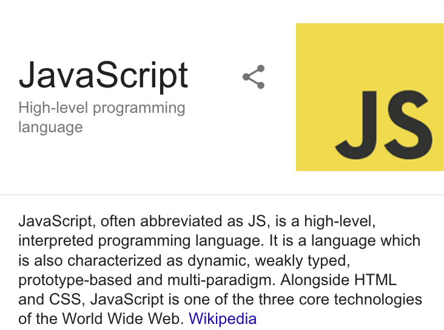
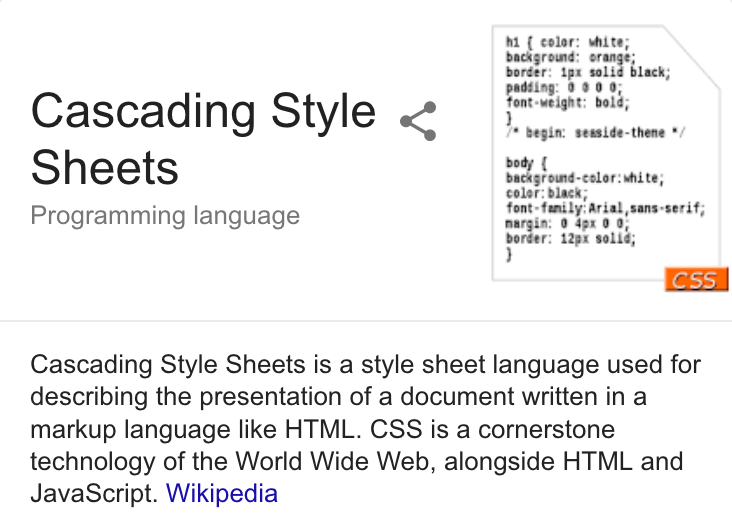
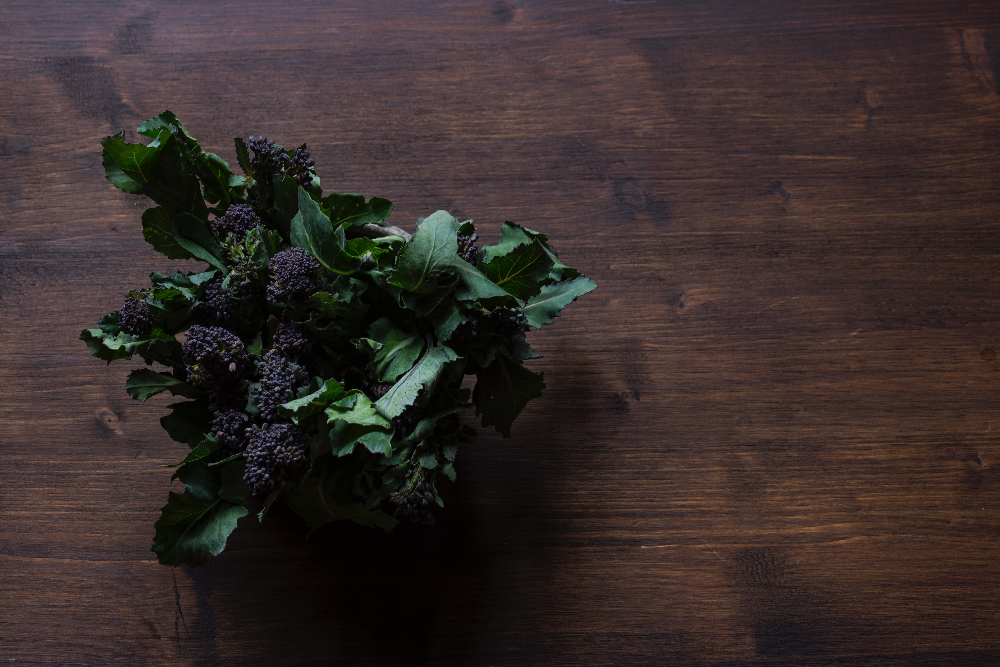

```{r setup, include=FALSE}
options(htmltools.dir.version = FALSE)
library(knitr)
knitr::opts_chunk$set(warning = FALSE, message = FALSE)
# options(knitr.table.format = "html")
library(tidyverse)
library(babynames)
library(fontawesome) # from github: https://github.com/rstudio/fontawesome
library(DiagrammeR)
```

layout: true
  
<div class="my-footer"><span>arm.rbind.io/slides/xaringan</span></div>

<!-- this adds the link footer to all slides, depends on my-footer class in css-->

---
name: xaringan-title
class: left, middle
background-image: url(img/brooke-lark-500141-unsplash.jpg)
background-size: cover

# Meet xaringan


### .fancy[Making slides in R Markdown]

.large[Alison Hill | rstudio::conf | `r Sys.Date()`]

<!-- this ends up being the title slide since seal = FALSE-->

---
class: middle, inverse

.left-column[

# `r emo::ji("confused")`

]

.right-column[
# /ʃæ.'riŋ.ɡæn/
]

---

class: right, middle


# Find me at...

[`r fa(name = "twitter")` @apreshill](http://twitter.com/apreshill)  
[`r fa(name = "github")` @apreshill](http://github.com/apreshill)  
[`r fa(name = "link")` alison.rbind.io](https://alison.rbind.io)  
[`r fa(name = "paper-plane")` alison@rstudio.com](mailto:alison@rstudio.com)


---
name: setup
class: middle, inverse

# Did you do the <br> .fat[.fancy[pre-work setup?]]

.large[https://arm.rbind.io/prework/]


---
name: usecourse
class: middle, inverse

# Did you download the <br> .salt[.fancy[workshop package?]]


```{r eval = FALSE, echo = TRUE}
remotes::install_github("armcompanion")
```


---
name: ninja
class: middle, inverse


# We assume:

--

### <i class="fab fa-markdown fa-lg fa-fw" style="float:left"/></i>&nbsp; you know Markdown 

--

### &nbsp; you know R Markdown 

--

### <i class="fab fa-html5 fa-lg fa-fw" style="float:left"></i>&nbsp; .saltinline[.fancy[you want awesome HTML5 slides]] 


---
name: novice
class: middle, inverse


# What you may not know:

--

### <i class="fab fa-js fa-lg fa-fw"></i>&nbsp; JavaScript

--

### <i class="fab fa-css3-alt fa-lg fa-fw"></i>&nbsp; CSS (Cascading Style Sheets)

--

### <i class="fab fa-html5 fa-lg fa-fw" style="float:left"></i>&nbsp; .saltinline[.fancy[you want awesome HTML5 slides]] 

---
name: nutshell
class: center, middle

# In a nutshell `r emo::ji("squirrel")`

.pull-left[




]

--

.pull-right[



]

---
name: remark.js

# .center[What is remark.js?]

.pull-left[

.center[


and


]

]

--

.pull-right[

To create:

> .fancy["A simple, in-browser, markdown-driven slideshow tool targeted at people who know their way around HTML and CSS"]

```{r echo = FALSE}
knitr::include_url("https://remarkjs.com/", height = "300px")
```
]

---
name: but
class: center, inverse, middle

# .fancy[but, remark.js doesn't know R...]

--

# .fancy[remark.js only supports Markdown]

---
name: xaringan

# .center[What is xaringan?]

.pull-left[

.center[


and


and


]

]

--

.pull-right[

To create:

> .fancy["An R package for creating HTML5 presentations with remark.js through R Markdown."]

```{r echo = FALSE}
knitr::include_url("https://arm.rbind.io/slides/xaringan.html", height = "300px")
```
]
---
name: diagram

# Hello `r fa(name = "user-ninja", fill = "white")`

With R Markdown, you are used to this:


--

With **xaringan** (no `pandoc`!):

```{r echo = FALSE, out.width = '75%', out.height = "50%"}
# Create a graph as a left-to-right path
graph <-
  create_graph() %>%
  add_path(
    n = 5, 
    type = "step",
    label = c(
      "xaringan\\n .Rmd", "knitr", ".md",
      "remark.js via\\n xaringan::moon_reader", "html"),
    node_aes = node_aes(  # set node aesthetics
      shape = c("circle", "square", "circle", "rectangle", "circle"),
      width = c(0.75, 0.5, 0.5, 2, 0.5),
      color = "#3C3C3C",
      fontcolor = "black",
      fillcolor = c("#61acf0", "#f0a561", "#cbd20a", "#f0a561", "#e74a2f"),
      fontname = "Lato"
    ),
    edge_aes = edge_aes(  # set edge aesthetics
      color = "#3C3C3C"
    )
  ) %>%
  add_global_graph_attrs(attr = "layout", value = "dot", attr_type = "graph") %>%
  add_global_graph_attrs(attr = "rankdir", value = "LR", attr_type = "graph")

# View the graph in the Viewer
graph %>% render_graph()
```


---
class: inverse, middle, center

# `r fa(name = "user-ninja", fill = "white")`

# .fancy[Let's make a slide deck right now]

--

.pull-left[
### .fancy[.center[Local with GitHub]]
### .fancy[.center[`r emo::ji("computer")` + <i class="fab fa-github fa-lg fa-fw"></i>]]
]

--

.pull-right[
### .fancy[.center[Cloud or Local (no GitHub)]]
### .fancy[.center[`r emo::ji("cloud")` | `r emo::ji("computer")`]]
]


---
name: start-here
class: inverse, middle

.pull-left[
### .fancy[.center[Local with GitHub]]
### .fancy[.center[`r emo::ji("computer")` + <i class="fab fa-github fa-lg fa-fw"></i>]]

1. Make a [repo on GitHub](https://happygitwithr.com/new-github-first.html#make-a-repo-on-github-1)

1. Make a [new RStudio project via git clone](https://happygitwithr.com/new-github-first.html#new-rstudio-project-via-git-clone) <br>
    *File > New Project > Version Control > Git*

]

--

.pull-right[
### .fancy[.center[Cloud or Local]]
### .fancy[.center[`r emo::ji("cloud")` | `r emo::ji("computer")`]]

1. Make a new RStudio project via wizard <br>
    *File > New Project > New Directory > New Project*

]


--

<hr>

.center[When inside your new project, do:

*File > New File > R Markdown > From Template*

Select .acidinline["arm-xaringan"] from the .heatinline[**armcompanion**] package
]


---
# Let's make this a slide deck


.pull-left[
Where you see:
```{r eval = FALSE}
---
output: html_document #<<
---
```
] 

--

.pull-right[
Change to:
```{r eval = FALSE}
---
output: xaringan::moon_reader #<<
---
```
] 

--
.pull-right[
Save this!
]

---

# Moon reader `r emo::ji("astronaut")`


Click the `Knit` button to compile it


--


Do you see both slides?

--

- Title slide `r emo::ji("cry")`

--

- Content slide `r emo::ji("rage")`

--

Don't worry: it gets much better. But first...


---
# Infinite moon reader `r emo::ji("rocket")`

- Now use the [RStudio Addin](https://rstudio.github.io/rstudioaddins/)<sup>1</sup> and select _xaringan: Infinite Moon Reader._ 

--

- Generates live preview the slides (every time you update and save the Rmd document, the slides will be automatically reloaded in RStudio Viewer.)

--

- Be sure to click on the "Show in new window" button in your RStudio viewer pane.

--

- In your browser, see the `...html#41` at the end? Make it `...html#hop` `r emo::ji("rabbit")`


---
name: skip
class: middle, inverse

# .fancy[And we're back!]

This is the power of using:

```{r eval = FALSE}
---
  
name: something

# This is really something!
```

--

You can [name individual slides](https://github.com/gnab/remark/wiki/Markdown#name), then cross link to them too from other slides in your deck: 

`[hop back to the end](#hop)` -> [hop back to the end](#hop)


???

For example, for these slide decks today, I named all the Your Turn slides so that they would be easily linkable.

---
name: keyboard-demo
class: center, inverse, middle

# .fancy[Keyboard shortcuts]

Press `h` or `?` to see the `remark.js` [keyboard shortcuts](https://bookdown.org/yihui/rmarkdown/xaringan-key.html). 

--

A useful workflow for presenting; if you have two screens, turn off display mirroring then press `c` to clone:

.pull-left[

# `r fa(name = "desktop", fill = "white")`

On the presentation screen:

Move cloned window to this screen <br>
Then press `f` for full-screen mode

]

.pull-right[

# `r fa(name = "laptop", fill = "white")`

On your laptop screen:

Press `p` for presenter mode on laptop <br>
Wish you had used `???` to add [presenter notes](https://bookdown.org/yihui/rmarkdown/xaringan-format.html#xaringan-notes)
]

???

Don't forget to add presenter notes- when you are in presenter mode you see them but your audience does not! You use three question marks at the bottom of your slide to separate out your notes.

---
name: sfah
class: center, middle

---

template: sfah

## .salt[SALT] .fat[FAT]

## .acid[ACID] .heat[HEAT]

---
name: outline
template: sfah

## .salt[REMARK.JS] [`r emo::ji("link")`](#block1) &nbsp; .fat[CHUNKS] [`r emo::ji("link")`](#block2)

## .acid[IMAGES] [`r emo::ji("link")`](#block3) &nbsp; .heat[THEMES] [`r emo::ji("link")`](#block4)

---
name: salt
class: inverse, middle, center
background-image: url(img/jason-tuinstra-551608-unsplash.jpg)
background-size: cover

# SALT = remark.js

???

SALT enhances flavor

REMARK.JS enhances your code

---
name: block1

# remark.js

What you need to know now:

- [Making slides](#newslide-demo)

- Align [all](#fullalign-demo) or [some slide content](#textalign-demo)

- [Incremental reveals](#increment-demo)

- [Two-column slides](#pull-demo)


---
name: newslide-demo

# Making slides

.pull-left[
- Slide 1 starts where YAML ends

- 3 dashes in a row `---` on a line by itself is a new slide 
]

.pull-right[
```
---
title: "armdeck"
output: xaringan::moon_reader 
---

# Introduce yourself!

> My name is Alison and I am a Data Scientist & Professional Educator at RStudio. I live in Portland, Oregon with my husband, daughter, and our sourdough starter.

---
# Find me at...

All the details...

```
]


---
name: fullalign-demo

# Align an entire slide

.left-column[

### Horizontal

```
*left,
center, 
right
```

<hr>

### Vertical

```
*top, 
middle, 
bottom 
```


]

--

.right-column[

```{r eval = FALSE}
---

class: center, middle #<<

# Slide with centered content in the middle

My name is Alison. I like hot toddies, `#rdogladies`, and babies.

---
```
]


---

class: center, middle


.left[
```
---

class: center, middle
```
]

# Slide with centered content in the middle

My name is Alison. I like hot toddies, `#rdogladies`, and babies.


---

name: textalign-demo

# Align some text only

.left-column[
### Horizontal only

```
.left[words]

.center[words]

.right[words]
```
]

--

.right-column[

```{r eval = FALSE}
---

class: center, middle 

# Slide with some aligned text

My name is Alison. I like hot toddies, `#rdogladies`,...

.left[and babies.] #<<

---
```
]

---

class: center, middle

.left[
```
---

class: center, middle
```
]

# Slide with some aligned text

My name is Alison. I like hot toddies, `#rdogladies`,...

.left[and babies.]


---

class: inverse, center, top
background-image: url(img/brooke-lark-500141-unsplash.jpg)
background-size: cover

# .fancy["but you promised us pretty pictures..."]


---

name: mdimage-demo
class: middle

.pull-left[
```{r eval = FALSE}
---

class: center, middle 

# Hi there, with an image

My name is Alison. I like hot toddies, 
`#rdogladies`, and

  #<<

---
```

]


.pull-right[

.center[.middle[
### Hi there, with an image

My name is Alison. 
I like hot toddies, 
`#rdogladies`, and

]]

]


--

.footnote[
In "real life", you'll often want to use straight-up HTML too:  
``
]
---

name: increment-demo

# Incremental reveals

.left-column[


```
# Hi there

My name is Alison

--

I like hot toddies

--

`#rdogladies`

--

and babies
```
]

--

.right-column[

### Hi there

My name is Alison
{{content}}

]

--

I like hot toddies
{{content}}

--

`#rdogladies`
{{content}}

--

and babies


<!--https://stackoverflow.com/questions/46408057/incremental-slides-do-not-work-with-a-two-column-layout-->

---

name: pull-demo

.left-column[
# Two-columns
```
.pull-left[
...

]

.pull-right[
...

]
```
]


--

.right-column[

.pull-left[
Momtocat on your left


]

.pull-right[
Poptocat on your right


]
]

--

.footnote[
[1] On a full slide, these are each 47% width.

[2] You can also similarly use `.left-column[]` and `.right-column[]`. The sizes are then 20% and 75%, respectively.
]


---
name: section
class: top, inverse
background-image: url(img/jason-tuinstra-551608-unsplash.jpg)
background-size: cover

---
name: yourturn
template: section

.left-column[
# <i class="fas fa-edit"></i> <br>.fancy[Your turn]
]

---
name: yourturn1
template: yourturn


.right-column[
[Season](#block1) some slides with `remark.js` salt! Consider trying:

1. Add [presenter notes with `???`](#keyboard-demo)

1. Incremental reveals with `--` ([demo slide](#increment-demo))

1. Align all content with the `class` slide property ([demo slide](#fullalign-demo))

1. Align some text on a slide with `.left / .center / .right` ([demo slide](#textalign-demo))

1. Create two-column slides with `.pull-left / .pull-right / .left-column / .right-column` ([demo slide](#pull-demo))

]

.left-column[
## .fancy[.saltinline[10:00 minutes]]
]


.footnote[
Don't despair- we'll fatten up our slides with R chunks next...
]

---
name: fat
class: inverse, top, center
background-image: url(img/bake-599521_1920.jpg)
background-size: cover

---
template: fat

# FAT

---
template: fat

# FAT = CHUNKS

---
name: block2

# Chunks

What you need to know now:

- [Highlight your code](#highlightjs-demo)

- [Add a table](#table-demos)

- [Add a plot](#plot-demo)

---
name: highlightjs-demo

# Highlight your code

Why? It makes it more readable `r emo::ji("eyes")`

```{r eval = FALSE}
---
title: "armdeck"
subtitle: "rstudio::conf 2019"
author: "Alison Hill"
date: "`r Sys.Date()`"
output: 
  xaringan::moon_reader:
    nature: #<<
      highlightStyle: github #<<
      highlightLines: true #<<
---
```

--

The [highlight style options are](https://github.com/gnab/remark/wiki/Configuration):

  + `arta`, `ascetic`, `dark`, `default`, `far`, `github`, `googlecode`,   `idea`, `ir-black`, `magula`, `monokai`, `rainbow`, `solarized-dark`, `solarized-light`, `sunburst`, `tomorrow`, `tomorrow-night-blue`, `tomorrow-night-bright`, `tomorrow-night`, `tomorrow-night-eighties`, `vs`, `zenburn`.

---
name: highlight-input

# Highlight code input

.pull-left[

````
```{r tx-wrangle}`r ''`
library(babynames)
library(tidyverse)
tx_names <- babynames %>%
  filter(name == "Dallas" | 
         name == "Austin") %>%
  filter(sex == "F") 
*glimpse(tx_names) #<<
```
````
]

.pull-right[

```{r tx-wrangle-input, eval = FALSE}
library(babynames)
library(tidyverse)
tx_names <- babynames %>%
  filter(name == "Dallas" | 
         name == "Austin") %>%
  filter(sex == "F") 
glimpse(tx_names) #<<
```
]

.footnote[
See https://slides.yihui.name/xaringan/#31

Note that to highlight a line of plain markdown text, use a `*` (from [remark docs](https://github.com/gnab/remark/wiki/Configuration))
]

---
name: highlight-output

# Highlight code output

.pull-left[

````
```{r tx-wrangle, highlight.output = 3:4}`r ''`
library(babynames)
library(tidyverse)
tx_names <- babynames %>%
  filter(name == "Dallas" | 
         name == "Austin") %>%
  filter(sex == "F") 
glimpse(tx_names) 
```
````

Other options:

+ `highlight.output = TRUE`
+ `highlight.output = c(1, 3)`
]

.pull-right[

```{r tx-wrangle-output, highlight.output = 3:4}
library(babynames)
library(tidyverse)
tx_names <- babynames %>%
  filter(name == "Dallas" | 
         name == "Austin") %>%
  filter(sex == "F") 
glimpse(tx_names) 
```
]


.footnote[
See https://slides.yihui.name/xaringan/#32
]

---
name: table-demos

.left-column[
# Hello table
]

.right-column[

```{r}
head(tx_names)
```

]


---

.left-column[
# Hello kable?

]

.right-column[

```{r}
head(tx_names) %>% 
  knitr::kable()
```

]

---

.left-column[
# Hello kable!

]


.right-column[
```{r}
head(tx_names) %>% 
  knitr::kable(format = "html")
```

]

.footnote[
You can set this as a global option for all your slides using [`options(knitr.table.format = "html")`](https://github.com/yihui/knitr/blob/cf7664894e237e71e4fd9c633df9ae6cd87ea382/R/table.R)
]

---


.left-column[
# Hello `DT`
]

.right-column[

```{r eval=require('DT'), tidy=FALSE}
library(DT)
head(tx_names) %>% 
  datatable()
```

]

---

.left-column[
# Hello `gt`
]

.right-column[

```{r}
library(gt)
head(tx_names) %>% 
  gt()
```

]

---

.left-column[
# Hello `leaflet`
]

.right-column[

```{r out.width='100%', fig.height=6, eval=require('leaflet')}
library(leaflet)
leaflet() %>% addTiles() %>% setView(lat = 30.2621, lng = -97.7382, zoom = 17)
```
]


---

.left-column[
# Hello plot
]

.right-column[

```{r txgirls-plot}
library(babynames)
library(tidyverse)
tx_names <- babynames %>%
  filter(name == "Dallas" | name == "Austin") %>% 
  filter(sex == "F") 
name_plot <- ggplot(tx_names , 
                    aes(x = year, 
                        y = prop,  
                        group = name, 
                        color = name)) + 
  geom_line() 
```

]

---

.pull-left[
# `r emo::ji("scream")`

## Why so ugly?
]

--

.pull-right[

````
```{r}`r ''`
name_plot
```
````

```{r echo = FALSE}
name_plot
```

]

.footnote[
The [default dpi](https://yihui.name/knitr/options/#plots) = 72. <br>
The [default fig.retina](https://github.com/rstudio/rmarkdown/blob/master/R/html_document.R)  = 2. <br>
That means the dpi is 72 x 2 = 144
]

---
name: plot-demo

.pull-left[
# `r emo::ji("tada")`

]

.pull-right[

````
```{r fig.retina = 3}`r ''`
name_plot
```
````

```{r fig.retina = 3, echo = FALSE}
name_plot
```
]

.footnote[
That means the dpi is 72 x 3 = 216 <br>
`out.width` = `fig.width` * `dpi` / `fig.retina`
]

---
class: inverse
name: gg-theme

.pull-left[
# `r emo::ji("surprise")`

````
```{r dev = 'svg', dev.args = list(bg = "transparent")}`r ''`
invthm <- theme_minimal() + 
  theme(
    panel.background = element_rect(fill = "transparent", colour = NA), 
    plot.background = element_rect(fill = "transparent", colour = NA),
    legend.background = element_rect(fill = "transparent", colour = NA),
    legend.key = element_rect(fill = "transparent", colour = NA),
    text = element_text(colour = "white"),
    axis.text = element_text(colour = "white")
  )
```
````

]

.pull-right[

````
```{r dev = 'svg', dev.args = list(bg = "transparent")}`r ''`
name_plot + invthm
```
````

```{r dev = 'svg', dev.args = list(bg = "transparent"), echo = FALSE}
invthm <- theme_minimal() + 
  theme(
    panel.background = element_rect(fill = "transparent", colour = NA), 
    plot.background = element_rect(fill = "transparent", colour = NA),
    legend.background = element_rect(fill = "transparent", colour = NA),
    legend.key = element_rect(fill = "transparent", colour = NA),
    text = element_text(colour = "white"),
    axis.text = element_text(colour = "white")
  )
#theme_set(invthm)
name_plot + invthm
```
]


---
name: setup-chunk

# Control your plots

You'll often want to play with individual chunk options for plots like `fig.retina` and `out.width` (plus `fig.width` and `fig.height`), but you can also set your **global chunk options** in a setup chunk (your first R code chunk): 

--

````
```{r setup}`r ''`
knitr::opts_chunk$set(fig.retina = 3)
```
````

--

While we are at it, these options are good too:

````
```{r setup}`r ''`
knitr::opts_chunk$set(fig.retina = 3, warning = FALSE, message = FALSE)
```
````


--

.footnote[
[1] Read more about [images in R Markdown](http://www.zevross.com/blog/2017/06/19/tips-and-tricks-for-working-with-images-and-figures-in-r-markdown-documents)

[2] And see Hadley/Garrett's preferred [`ggplot2` chunk options](https://r4ds.had.co.nz/graphics-for-communication.html#figure-sizing)
]


---
name: tldr-side-by-side

# tl;dr: side-by-side code + plot

Why? Don't repeat yourself!

--


1. [Code first, plot second](#plot-last)

    - Chunk 1: `` {r plot-last, fig.show = 'hide'} ``
    - Chunk 2: `` {r ref.label = 'plot-last', echo = FALSE} ``
    
--

1. [Plot first, code second](#plot-first)

    - Chunk 1: `` {r plot-first, echo = FALSE} ``
    - Chunk 2: `` {r ref.label = 'plot-first', eval = FALSE} ``


---

.pull-left[

.salt[Code]

````
.pull-left[

```{r plot-last, fig.show = 'hide'}`r ''`
code goes here
```
]

.pull-right[
```{r ref.label = 'plot-last', echo = FALSE}`r ''`
```
]
````

]

--

.pull-right[

.acid[Output]

```{r echo = FALSE}
knitr::include_url("https://arm.rbind.io/slides/xaringan.html#plot-last")
```


]

---
name: plot-last

# Code first, plot second

.pull-left[
```{r plot-last, fig.show = 'hide'}
tx_names <- babynames %>%
  filter(name == "Dallas" | name == "Austin") %>% 
  filter(sex == "F")
tx_plot <- ggplot(tx_names, 
                    aes(x = year, 
                        y = prop,  
                        group = name, 
                        color = name)) + 
  geom_line() 
tx_plot
```
]

.pull-right[
```{r ref.label = 'plot-last', echo = FALSE, fig.retina = 3}
```
]


---


.pull-left[

.salt[Code]

````
.pull-left[

```{r plot-first, echo = FALSE}`r ''`
code goes here
```
]

.pull-right[
```{r ref.label = 'plot-first', eval = FALSE}`r ''`
```
]
````

]

--

.pull-right[

.acid[Output]

```{r echo = FALSE}
knitr::include_url("https://arm.rbind.io/slides/xaringan.html#plot-first")
```

]

---
name: plot-first

# Plot first, code second

.pull-left[

```{r plot-first, echo = FALSE, fig.retina = 3}
tx_names <- babynames %>%
  filter(name == "Dallas" | name == "Austin") %>% 
  filter(sex == "F")
tx_plot <- ggplot(tx_names, 
                    aes(x = year, 
                        y = prop,  
                        group = name, 
                        color = name)) + 
  geom_line() 
tx_plot
```

]

.pull-right[

```{r ref.label = 'plot-first', eval = FALSE}
```

]


---
name: yourturn2
template: yourturn

.right-column[

[Fatten](#block2) up your slides with some R code chunks (+ `knitr` butter). Consider:

1. Add a table ([demo slides](#table-demos))

1. Add a plot ([demo slide](#plot-demo))

1. Enable code highlighting ([demo slide](#highlightjs-demo)) +
  + Highlight R input ([demo slide](#highlight-input))
  + Highlight R output ([demo slide](#highlight-output))

1. Make some side-by-side code/plot slides ([demo slide](#tldr-side-by-side))

]

.left-column[
## .fancy[.fatinline[05:00 minutes]]
]


.footnote[
If you are in need of less text and more pics,<br> we'll throw some image acid on our slides next...
]

---
name: acid
class: inverse, center, middle
background-image: url(img/monika-grabkowska-1141662-unsplash.jpg)
background-size: cover

---
template: acid

# ACID

---
template: acid

# ACID = IMAGES

---
name: block3

# Images

What you need to know now:

- [Add background images](#background-image)

- [Add other images](#otherimages)

- [Make your title slide](#title-slides)

- [Add a logo](#logos)

---
name: background-image

# Background images

Use the [`background-image` property](https://github.com/gnab/remark/wiki/Markdown#background-image) just like you used classes:

- `background-image: url(https://blah.bla)`
- `background-size:`
    - `cover` --> rescales + crops with no empty space
    - `contain` --> rescales only
- `background-position:` play with [this](https://www.w3schools.com/cssref/pr_background-position.asp)

--

If it is a url: `url(http://bit.ly/arm-greens)`

--

If it is a local image, use relative file paths: `url(img/arm-greens.jpg)`


---
name: greens-none
class: center, middle, inverse
background-size: initial
background-image: url(http://bit.ly/arm-greens)


# .fancy[No background size]

Image size: 6016 × 4016

---
name: greens-cover
class: center, middle, inverse
background-image: url(http://bit.ly/arm-greens)
background-size: cover

# .fancy[Cover]


---
name: greens-contain
background-image: url(http://bit.ly/arm-greens)
background-size: contain
class: center, middle, inverse

# .fancy[Contain]

---
name: otherimages
class: middle

# All other images

You may use:

.pull-left[

``<br>
``
]

--

.pull-right[

````
```{r out.width = '50%'}`r ''`
# url
knitr::include_graphics("http://bit.ly/arm-greens") 
# local

```
````

To control size:
+ use [`knitr::include_graphics`](https://www.rdocumentation.org/packages/knitr/versions/1.20/topics/include_graphics)
+ combine with [knitr code chunk options](https://yihui.name/knitr/options/#plots) like `out.width`
]


---
name: title-slides
class: middle, center

# .fancy[Let's talk <br> .acid[title slides] ]


---
name: title-yaml

## Use your YAML .fancy[(mixed with HTML)]

.pull-left[

```{r echo = FALSE}
knitr::include_graphics("img/xaringan-title-chester.png")
```

.footnote[
Source: [Chester Ismay](http://bit.ly/infer-useR)
]

]

.pull-right[

From [.Rmd](https://github.com/ismayc/talks/blob/master/infer-useR/slide_deck.Rmd)

```{r eval = FALSE}
---
title: "Statistical Inference: A Tidy Approach"
subtitle: The <code><font color="black">infer</font></code> R package
author: 'Dr. Chester Ismay <br> Senior Curriculum Lead at 
<a href="https://www.datacamp.com/">DataCamp</a> <br> 
<a href="http://github.com/ismayc"><i class="fa fa-github fa-fw"></i>&nbsp; ismayc</a><br> 
<a href="http://twitter.com/old_man_chester"> <i class="fa fa-twitter fa-fw"></i>
&nbsp; @old_man_chester</a><br> <a href="mailto:chester@datacamp.com">
<i class="fa fa-paper-plane fa-fw"></i>&nbsp; chester@datacamp.com</a><br>'
date: 2018-07-12 &ensp; `r knitr::include_graphics("figure/user_au_logo_small.png")` 
<br><br> Slides available at <http://bit.ly/infer-useR> 
<br> Package webpage at <https://infer.netlify.com>
---
```

default class properties:

`class: center, middle, inverse, title-slide`


]

---

## Use your YAML .fancy[(mixed with HTML)]

.pull-left[

```{r echo = FALSE}

```

.footnote[
Source: [Jennifer Thompson](https://github.com/jenniferthompson/RMedicine2018); [full slide deck](https://jenthompson.me/slides/rmedicine2018/rmedicine2018#1)
]

]

.pull-right[

From [.Rmd](https://github.com/jenniferthompson/RMedicine2018/blob/master/rmedicine2018.Rmd)

```{r eval = FALSE}
---
title: "The Life & Times of a Reproducible Clinical Project in R"
author: "Jennifer L Thompson, MPH<br>
<span style = 'font-size: 50%;'>
Vanderbilt University Medical Center<br>
Department of Biostatistics + Center for Critical Illness, 
Brain Dysfunction & Survivorship</span>"
date: 'R/Medicine 2018<br><br>
`r icon::fa("link")` [bit.ly/jlt-rmed2018](https://bit.ly/jlt-rmed2018)
<br>`r icon::fa("twitter")` [jent103](https://twitter.com/jent103)'
output:
  xaringan::moon_reader:
    nature:
      titleSlideClass: ["left", "middle", "inverse"] #<<
---
```

.heatinline[.fancy[Override]] the default class properties!


]
---
name: title-seal

## Create your own .fancy[(*recommend!)]

.pull-left[

```{r echo = FALSE}
knitr::include_graphics("img/xaringan-title-julia.png")
```

.footnote[
Source: [Julia Silge](https://github.com/juliasilge/deming2018)
]

]

.pull-right[

From [.Rmd](https://github.com/juliasilge/deming2018/blob/master/intro.Rmd)
```{r eval = FALSE}
output:
  xaringan::moon_reader:
    seal: false #<<

---

class: inverse, center, middle

background-image: url(figs/p_and_p_cover.png)
background-size: cover


# Text Mining


### USING TIDY PRINCIPLES

.large[Julia Silge | Deming Conference | 4 Dec 2018]

---
```

]


???

seal disables 

---
name: logos
class: middle, center

# .fancy[Let's talk <br> .acid[logos] ]

tl;dr: treat like slide-specific background images!

---

layout: true

background-image: url(img/RStudio-Logo-Flat.png)
background-position: 0% 100%
background-size: 10%

---
name: logo-layout

# Layouts

```{r eval = FALSE}
---
YAML goes here
---
  
layout: true #<<

background-image: url(img/RStudio-Logo-Flat.png)
background-position: 0% 100%;
background-size: 10%

---

```

This will apply layout to _all_ slides. To cancel it, insert a blank slide:

```{r eval = FALSE}
---
  
layout: false

---
```

---


layout: true

background-image: url(img/RStudio-Logo-Flat.png), url(img/RStudio-Logo-Flat.png), url(img/RStudio-Logo-Flat.png)
background-position: 0% 100%, 100% 0%, 50% 100%
background-size: 10%, 10%, 10%

---
name: lots-of-logos

# Logos galore

```{r eval = FALSE}
---
YAML goes here
---
  
layout: true #<<

background-image: url(img/RStudio-Logo-Flat.png), url(img/RStudio-Logo-Flat.png), url(img/RStudio-Logo-Flat.png)
background-position: 0% 100%, 100% 0%, 50% 100%
background-size: 10%, 10%, 10%

---
```


Positioning:

+ bottom left: `0% 100%`
+ top right: `100% 0%`
+ bottom center: `50% 100%`


---

layout: true
  
<div class="my-footer"><span>rstd.io/arm-xaringan</span></div>

---
name: yourturn3
template: yourturn

.right-column[

Add some [acid](#block3) to your slides with images. Consider:

1. Adding a background image to a slide ([demo slides](#background-image))

1. Updating your title slide ([demo slides](#title-slides))

  + Option 1: Use your YAML ([demo slides](#title-yaml))
  
  + Option 2: Set `seal: FALSE` ([demo slides](#title-seal))

1. Adding a logo ([demo slide](#logos))

]

.left-column[
## .fancy[.acidinline[08:00 minutes]]
]


---
name: heat
class: inverse, center, middle
background-image: url(img/carlos-hevia-628152-unsplash.jpg)
background-size: cover

---
template: heat

# HEAT

---
template: heat

# HEAT = THEMES

---
name: block4

# Themes

What you need to know now:

- [Built-in themes](#themes)

- [Build your own theme](#css-theme)


---
name: themes

# Built-in themes


For each, theme and fonts are separate files:

```{r}
names(xaringan:::list_css())
```

--


To use, edit your YAML (no file extensions):
```{r eval = FALSE}
output:
  xaringan::moon_reader:
    css: [default, metropolis, metropolis-fonts] #<<
```


---
class: middle, center, inverse
name: css-theme

## Want more control, but less CSS?

```{r echo = FALSE}
knitr::include_graphics("https://pkg.garrickadenbuie.com/xaringanthemer/articles/images/examples.gif")
```

.footnote[
https://pkg.garrickadenbuie.com/xaringanthemer/
]


---
name: yourturn4
template: yourturn

.right-column[

Raise the [heat](#block4) on your slides by changing themes, using one of the built-in themes ([demo slides](#themes)).
<br>
<br>
<br>
<br>
<br>
<br>
]

.left-column[
## .fancy[.heatinline[03:00 minutes]]
]

---
name: rsconnect

# RStudio Connect `r emo::ji("cloud")` + `r emo::ji("computer")`


---
name: netlify

# Netlify `r emo::ji("computer")`

---
name: earlydeploy
class: middle, inverse, center

# `r emo::ji("mega")`

---
template: earlydeploy

## Go to [Netlify.com](https://www.netlify.com/) & Log in

```{r echo = FALSE}
knitr::include_graphics("img/netlify-landing.png")
```

---
template: earlydeploy


## Drag & drop the `.html` file for your slides to deploy

```{r echo = FALSE, out.width='60%'}
knitr::include_graphics("img/netlify-new-site.png")
```

  
---
template: yourturn
name: yourturn5

.right-column[

Serve your slides by publishing on either:

1. RStudio Connect ([demo slides](#rsconnect))

1. Netlify ([demo slides](#netlify))

<br>

]

.left-column[
## .fancy[.heatinline[05:00 minutes]]
]


---
name: hop
class: middle, center, inverse

# `r emo::ji("hole")`

This a slide much later in the deck!

Let's go back to where we left off...

--

In your browser, see the `...html#140` at the end? Make it `...html#skip`!
